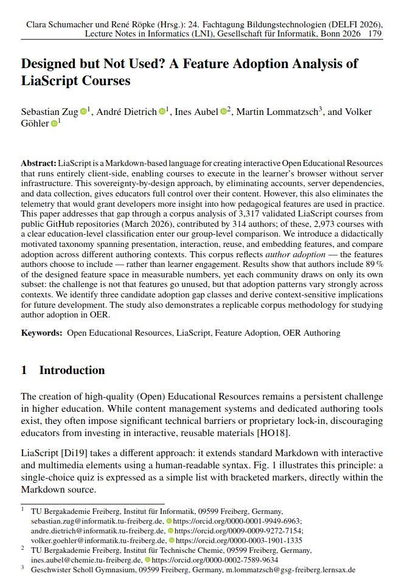
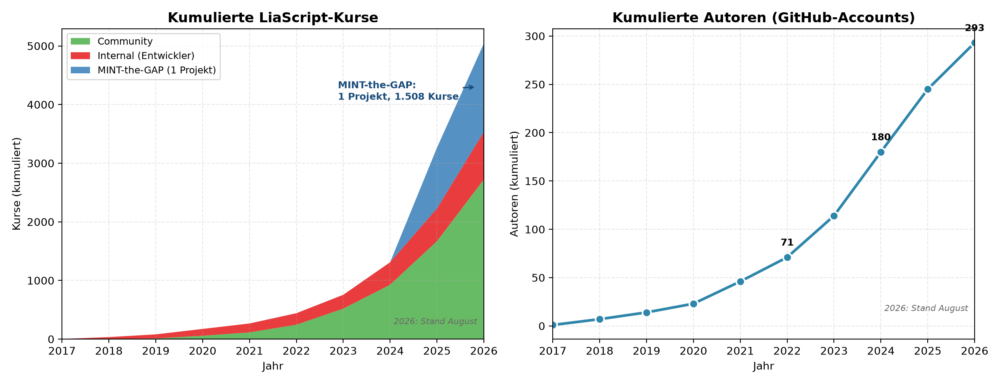
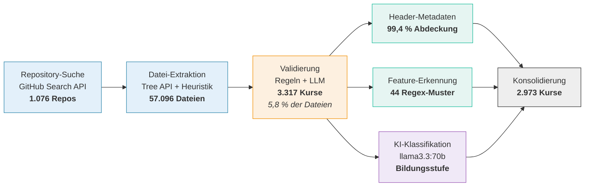

<!--
version:  1.0.0
language: de

narrator: Deutsch Female

tags: Vortrag, DELFI, LiaScript, OER, Feature-Adoption, Korpusanalyse

comment:  Designed but Not Used? — Feature-Adoption in einem System ohne
          Telemetrie. Vortrag auf der DELFI 2026.
          Vortragende: Sebastian Zug, André Dietrich, Ines Aubel
          (TU Bergakademie Freiberg).

author:   Sebastian Zug, André Dietrich, Ines Aubel, Martin Lommatzsch, Volker Göhler

import: https://raw.githubusercontent.com/LiaTemplates/LiveEdit-Embeddings/refs/tags/0.0.1/README.md
import: https://raw.githubusercontent.com/LiaTemplates/mermaid_template/0.1.4/README.md

persistent: true

edit: true

@style
.cols {
  display: flex;
  flex-wrap: wrap;
  align-items: center;
  justify-content: space-between;
  gap: 2rem;
}

.cols > * {
  flex: 1;
  min-width: 280px;
}

.bigfact {
  text-align: center;
  padding: 1.2rem 0;
}

.bigfact .num {
  font-size: 3.4rem;
  font-weight: 700;
  line-height: 1.1;
  color: #2E86AB;
}

.bigfact .cap {
  font-size: 1.15rem;
  color: #555;
  margin-top: .4rem;
}

@end

-->

[](https://liascript.github.io/course/?https://raw.githubusercontent.com/LiaPlayground/DELFI_2026_presentation/main/README.md)

# Designed but Not Used?

<h2>A Feature Adoption Analysis of LiaScript Courses</h2>

<div class="cols">
<div>

> __DELFI 2026 — Die 24. Fachtagung Bildungstechnologien__
>
> __Potsdam, September 2026__


</div>
<div>

> **Sebastian Zug$^1$, André Dietrich$^1$, Ines Aubel$^1$, Martin Lommatzsch$^2$, Volker Göhler$^1$**
>
> **$^1$TU Bergakademie Freiberg, $^2$Geschwister-Scholl-Gymnasium Freiberg**


</div>
</div>

<div class="cols">
<div>

Das zugehörige Paper finden Sie in der Digitalen Bibliothek der GI unter [Link](https://dl.gi.de/items/4da2a537-6a46-4f90-9276-618d41e8409b)

<!-- style="height:250px" -->

</div>
<div>

Dieser Vortrag ist unter folgenden [Link](https://liascript.github.io/course/?https://raw.githubusercontent.com/LiaPlayground/DELFI_2026_presentation/main/README.md) zu finden.

[qr-code](https://liascript.github.io/course/?https://raw.githubusercontent.com/LiaPlayground/DELFI_2026_presentation/main/README.md)

</div>
</div>

---

Dieser Foliensatz steht unter einer Creative-Commons-Lizenz (CC BY 4.0). Der Quelltext liegt auf [GitHub](https://github.com/LiaPlayground/DELFI_2026_presentation).

--{{0}}--
Herzlich willkommen. Diese Annotationen fassen die Erläuterungen im Zusammenhang mit der Vorstellung des Papers anlässlich der DELFI 2026 zusammen. Ausgehend vom 

## Was ist LiaScript?

> [!TIP]
> **LiaScript ist Markdown — erweitert um genau die Elemente, die für
> interaktive Lehre fehlen. Dabei bleibt alles ein Text - den man beliebig verändern und kompieren kann.**

--{{0}}--
Zunächst kurz: Was ist LiaScript überhaupt? Für alle, die es noch nicht kennen.

````markdown @embed.style(height: 520px; min-width: 100%; border: 1px black solid)
<!--
import: https://raw.githubusercontent.com/liaTemplates/ABCjs/main/README.md
-->
# TU Bergakademie Freiberg

**Standard Markdown**

Die Bergakademie wurde **1765** gegründet und ist damit die älteste noch bestehende ~~Montanuniversität~~.

**Quizz**

Welches Element wurde in Freiberg entdeckt?

[[ (Germanium|Indium) ]]

**Interaktion**

``` abc
X:353
T: GLUECK AUF DER STEIGER KOEMMT
N: E1512
O: Europa, Mitteleuropa, Deutschland
R: Staende -, Bergmanns - Lied
M: 4/4
L: 1/16
K: G
| G8F4A4 | G8z8 | B8A4c4 | B8z4G2A2 | B4B4B4A2B2 | c4A3AA4
A2B2 | c4c4c4B2c2 | d4B3BB4A4 | G8F8 | G4e4d4c2A2 | B8A8 | G8z8
```
@ABCJS.eval

??[Familienschacht Freiberg](https://sketchfab.com/3d-models/familienschacht-freiberg-germany-7c7d30506c554385a4a4321366e2e601 "Quelle: sketchfab.com")
````

--{{0}}--
Links der Quelltext, rechts das Ergebnis. Formatierung, Mathematik, Tabellen
und Quizze — alles in einer Textdatei, alles sofort im Browser. Genau diese
Bausteine sind es, deren Nutzung wir später vermessen.

### Sovereignty by Design

> [!IMPORTANT]
> LiaScript Dokumente werden im Browser interpretiert - die Ausführungsumgebung läuft lokal. 

<div class="cols">
<div>

- **kein Server** → keine Logs
- **keine Accounts** → keine Nutzerprofile
- **keine Telemetrie** → keine Nutzungsdaten

</div>
<div>

> __Autor:innen behalten die volle Kontrolle über ihre Inhalte bzw. teilen diese sehr einfach.__
>
> Wir wissen dafür **nicht**, wie LiaScript verwendet wird.

</div>
</div>

--{{0}}--
Das ist eine bewusste Designentscheidung: keine Server, keine Konten, keine
Telemetrie. Für offene Bildungsressourcen ist das genau richtig. Aber es hat
einen Preis — und der ist der Ausgangspunkt dieses Papers.

### Die Community wächst ...



<div class="bigfact">
<div class="num">5.042</div>
<div class="cap">Kurse in 293 Repository-Accounts · Stand August 2026</div>
</div>

> __... und damit die Nachfrage nach Tutorials und Workshops.__

## Das Problem

> [!IMPORTANT]
> **Wer ist eigentlich die Zielgruppe und welche Feature sollten dort fokussiert werden?**

<details>
<summary>Sachkundeunterricht Klasse 4 - Adrian Nemetschek - ([Link zum Material](https://github.com/aua-einiges/LiaScript_Sachunterricht_Lernbereich3/blob/main/DL_Sachunterricht1_Nem%20(1).md)</summary>

<iframe
  src="https://liascript.github.io/course/?https://raw.githubusercontent.com/aua-einiges/LiaScript_Sachunterricht_Lernbereich3/main/DL_Sachunterricht1_Nem%20(1).md#3"
  style="width:100%; height:80vh; border:1px solid #ccc"
  allowfullscreen>
</iframe>

</details>

<details>
<summary>Fonts Template für wissenschaftliche Community - André Dietrich - ([Link zum Material](https://liascript.github.io/course/?https://raw.githubusercontent.com/LiaPlayground/Fonts/main/README.md#6))</summary>

<iframe
  src="https://liascript.github.io/course/?https://raw.githubusercontent.com/LiaPlayground/Fonts/main/README.md#2"
  style="width:100%; height:80vh; border:1px solid #ccc"
  allowfullscreen>
</iframe>

</details>

> [!TIP]
> __Die Vermutung, dass unterschiedliche Anwendungskontexte eine verschiedene Nutzungsmuster zeigen ist offensichtlich, aber wie können wir das nachweisen?__

## Methodik

> [!IMPORTANT]
> **Kurse liegen in öffentlichen Repositories. Das ist der einzige Kanal, über den wir Nutzung beobachten können.**

<details>

<summary>LiaScript Gehversuche - Irina Feldbrügge - ([Link zum Material](https://liascript.github.io/course/?https://raw.githubusercontent.com/LiaPlayground/Fonts/main/README.md#6))</summary>

<iframe
  src="https://liascript.github.io/course/?https://raw.githubusercontent.com/IRFE2023/LIASCRIPT/refs/heads/main/warum.md#1"
  style="width:100%; height:80vh; border:1px solid #ccc"
  allowfullscreen>
</iframe>

</details>

> [!TIP]
> Die manuelle Erfassung der Rückmeldungen der Nutzenden ist offenbar kein geeignetes Vorgehensmodell.

### Der Korpus

> Für die Erfassung der Daten wurden die offenen LiaScript Materialsammlungen durchsucht.



<div class="cols">
<div>

<!-- data-type="none" -->
| | |
|---|---|
| Validierte Kurse | **3.317** |
| Committer | **314** |
| Repository-Accounts | **205** |
| Stand | **März 2026** |

*Die Analyse nutzt den Stand von März 2026 — der Korpus ist seither
weiter gewachsen.*

</div>
<div>

> [!WARNING]
> **Wichtige Einschränkung**
>
> Wir messen *author adoption* — welche Features Autor:innen **einbauen**.
> Nicht, was Lernende damit tun.

</div>
</div>

### Inhalte der Kurse

Nicht jede Gruppe von Autor:innen ist vergleichbar — wir trennen daher
zuerst nach **Repository-Kontext**, dann nach **Bildungsstufe**:

<!-- data-type="none" -->
| Gruppe | Kurse | Accounts | Charakter |
|---|---:|---:|---|
| **Internal** | 462 | 7 | Kernteam: Templates, Demos, eigene Lehre |
| **MINT-the-GAP** | 1.147 | 1 | Eine Schulinitiative, strukturierte MINT-Kurse |
| **Comm-Uni** | 1.178 | 167 | Community, Hochschule — größte & vielfältigste Gruppe |
| **Comm-School** | 186 | 38 | Community, Schule (Primar & Sekundar) |

> [!NOTE]
> **Warum trennen?** MINT-the-GAP stellt fast ein Drittel aller Kurse aus
> **einem** Account — ohne Trennung würde diese Initiative jede Aussage
> über „die Community" dominieren.

     {{2}}
> Weitere **344 Kurse** (Berufs-/Weiterbildung oder ohne klare Zuordnung)
> bleiben außen vor → **2.973 Kurse** im Gruppenvergleich.

--{{0}}--
Bevor wir auf die Ergebnisse schauen, müssen wir eine Entscheidung erklären.
Wir können nicht einfach über „die LiaScript-Community" sprechen, denn die
Autor:innen haben sehr unterschiedliche Beziehungen zum Werkzeug. Deshalb
trennen wir in zwei Schritten: zuerst nach Repository-Kontext — wer gehört
zum Entwicklerteam, wer ist eine eigene Initiative — und innerhalb der
übrigen Community nach Bildungsstufe, also Hochschule oder Schule.

--{{1}}--
Der wichtigste Grund steht hier: MINT-the-GAP ist ein einzelner Account mit
über tausend Kursen, fast ein Drittel des Korpus. Würden wir das nicht
heraustrennen, wäre jede Aussage über die Community in Wahrheit eine Aussage
über dieses eine Projekt.

--{{2}}--
Und noch eine Ehrlichkeit: Dreihundertvierundvierzig Kurse lassen sich nicht
eindeutig zuordnen — Berufsbildung, Weiterbildung, oder der Klassifikator war
unsicher. Die lassen wir im Gruppenvergleich weg. So kommen wir von
dreitausenddreihundert auf knapp dreitausend Kurse.

### Merkmalskategorisierung

**44 binäre Merkmale**, erhoben über Muster im Markdown-Quelltext —
gruppiert nach der **didaktischen Barriere**, die sie adressieren:

| Kategorie | Entwurfsabsicht | Beispiele |
|---|---|---|
| <span style="color:#4393c3">**Presentation**</span> | Selbstgesteuert & barrierearm | Narrator (TTS), Animationen, Effekte, Galerien |
| <span style="color:#d6604d">**Interaction**</span> | Aktives Lernen & Rückmeldung | Quiz-Typen, Texteingabe, Umfragen |
| <span style="color:#4dac26">**Reuse**</span> | Skalierbares Autor:innenhandwerk | Imports, eigene Makros, Templates |
| <span style="color:#998ec3">**Embedding**</span> | Ausführbare Umgebungen | Code-Ausführung, WebApps, Skripte |

     {{1}}
> [!WARNING]
> Erfasst wird **Vorhandensein, nicht Zentralität**: Ein Kurs mit einem
> einzigen Quiz zählt wie ein quizzentrierter Kurs.

--{{0}}--
Die vierundvierzig Merkmale erheben wir über Mustererkennung im Quelltext.
Entscheidend ist die Gruppierung: Wir sortieren nicht nach technischer
Verwandtschaft, sondern danach, welche didaktische Hürde ein Feature abbaut.
Presentation zielt auf Zugänglichkeit — Sprachausgabe etwa macht einen Kurs
für Screenreader nutzbar. Interaction erlaubt Selbsttests ohne Lernplattform.
Reuse überträgt das Don't-Repeat-Yourself-Prinzip auf Kurse. Und Embedding
schließt die Lücke zwischen Erklärung und eigenem Ausprobieren.

--{{1}}--
Eine Einschränkung, die Sie beim Lesen der Prozentwerte gleich mitdenken
sollten: Wir messen, ob ein Feature vorkommt — nicht, wie zentral es für den
Kurs ist. Die Zahlen sagen also, wie weit ein Feature reicht, nicht wie
intensiv es genutzt wird.

## Analyse

<div class="bigfact">
<div class="num">89 %</div>
<div class="cap">des Feature-Raums werden messbar genutzt</div>
</div>

     {{1}}
Nur **5 von 44** Merkmalen bleiben unter 1 %:

     {{1}}
| Merkmal | Anteil |
|---|---:|
| Effects | 0,00 % |
| Classroom | 0,03 % |
| TTS blocks | 0,06 % |
| Code projects | 0,42 % |
| Animated CSS | 0,69 % |

     {{2}}
> [!NOTE]
> Das Problem ist also **nicht**, dass Merkmale ungenutzt bleiben.

--{{0}}--
Kommen wir zu den Ergebnissen — und die erste Zahl hat uns selbst überrascht.
Neunundachtzig Prozent des Merkmalsraums werden in messbarem Umfang
eingesetzt. Unsere Sorge, große Teile der Sprache seien tote Buchstaben, war
unbegründet.

--{{1}}--
Die Zahl kommt so zustande: Wir erheben vierundvierzig Merkmale, und nur
fünf davon liegen unter einem Prozent — das sind diese hier. Bleiben
neununddreißig, also knapp neunundachtzig Prozent. Die Ein-Prozent-Schwelle
ist bewusst konservativ: Sie entspricht etwa dreiunddreißig von
dreitausenddreihundert Kursen und markiert Merkmale, die praktisch nicht
vorkommen — nicht solche, die bloß selten sind.

--{{2}}--
Das Problem liegt also nicht darin, dass Merkmale ungenutzt bleiben. Es liegt
woanders — und das sehen Sie auf den nächsten Folien.

### Adoptionsraten über alle Kurse

| Kategorie | Widely adopted | % | Rarely adopted | % |
|---|---|---:|---|---:|
| <span style="color:#4393c3">Presentation</span> | Narrator | 58,6 | Galleries | 7,3 |
| | Animations | 22,8 | Animated CSS | 0,7 |
| | TTS fragments | 11,6 | TTS blocks | 0,1 |
| | Anim. blocks | 11,0 | Effects | 0,0 |
| <span style="color:#d6604d">Interaction</span> | Any quiz | 45,5 | Single choice | 9,0 |
| | Text quiz | 28,8 | Selection quiz | 7,3 |
| | Multiple choice | 10,2 | Quiz hints | 4,9 |
| | | | Task lists | 4,7 |
| | | | Surveys | 2,7 |
| | | | Matrix quiz | 1,6 |
| <span style="color:#4dac26">Reuse</span> | Macros (any) | 72,1 | Custom macros | 8,7 |
| | Imports | 59,6 | | |
| | Ext. scripts | 51,1 | | |
| <span style="color:#998ec3">Embedding</span> | Math | 48,0 | ASCII diagrams | 9,8 |
| | Script tags | 20,8 | WebApps | 5,6 |
| | HTML embeds | 15,7 | Exec. code | 3,1 |
| | | | Code projects | 0,4 |

*Adoptionsraten über alle 3.317 Kurse, je Kategorie nach Rate sortiert.
Merkmale über 10 % links, darunter rechts. Auswahl aus 44 erhobenen Merkmalen.*

--{{0}}--
Hier die Aufteilung: links die Merkmale über zehn Prozent, rechts die
darunter. Jede Kategorie hat beide Seiten — es gibt keinen Bereich der
Sprache, der komplett brachliegt, und keinen, der durchgängig genutzt wird.
Makros, Imports und der Narrator führen das Feld an; ganz unten stehen
Effekte und Code-Projekte.

     {{0}}
<span style="color:#4393c3">**Presentation**</span> — teilt sich scharf:
Narrator und Animationen mit geringem Aufwand breit genutzt,
Text-to-Speach (TTS) scheint kaum Anwendungen zu finden.

     {{1}}
<span style="color:#d6604d">**Interaction**</span> — von einfachen Quizzen dominiert
(45,5 %); komplexe Matrix-Quiz und Umfragen werden kaum genutzt..

     {{2}}
<span style="color:#4dac26">**Reuse**</span> — getragen von Imports und Makros:
Die meisten Autor:innen **konsumieren** geteilte Bausteine,
kaum jemand **definiert** eigene (8,7 %).

     {{3}}
<span style="color:#998ec3">**Embedding**</span> — streut am weitesten:
Mathematik erreicht 48 %, doch ausführbarer Code (3,1 %) und
Code-Projekte (0,4 %) bleiben Nische — obwohl sie ein Alleinstellungsmerkmal sind.

--{{0}}--
Jede Kategorie hat ihr eigenes Muster. Presentation teilt sich scharf: Was
eine Zeile im Header kostet — der Narrator — nutzen fast sechzig Prozent.
Die feineren Varianten derselben Technik, TTS-Blöcke etwa, liegen bei null
Komma eins. Es ist nicht das Interesse, das fehlt, sondern die Sichtbarkeit
der zweiten Stufe.

--{{1}}--
Interaction ist schlicht Quiz-Land. Fast die Hälfte aller Kurse hat ein Quiz,
aber die spezielleren Formate — Umfragen, Matrix-Aufgaben — bleiben Randnotiz.

--{{2}}--
Reuse finde ich am aufschlussreichsten: Imports und Makros werden breit
genutzt, aber eigene Makros definieren nicht einmal neun Prozent. Die
Community konsumiert geteilte Bausteine, sie produziert sie kaum. Das ist
genau der Punkt, an dem Infrastruktur ansetzen könnte.

--{{3}}--
Und Embedding streut am weitesten. Mathematik fast fünfzig Prozent —
ausführbarer Code drei. Dabei ist gerade das ein Alleinstellungsmerkmal von
LiaScript. Die Ein-Prozent-Schwelle für „ungenutzt" haben wir übrigens
bewusst konservativ gewählt: Ein Merkmal gilt erst dann als nicht adoptiert,
wenn es in weniger als etwa dreiunddreißig von dreitausenddreihundert Kursen
vorkommt.

### Adoptionsraten nach Gruppen

Sobald man den Korpus nach Autorengruppen aufteilt, zerfällt das
aggregierte Bild — **kein Akteur führt durchgängig**:

| Kategorie | Feature | Internal | MINT | Comm-Uni | Comm-Sch. |
|---|---|---:|---:|---:|---:|
| <span style="color:#4393c3">Presentation</span> | Narrator | 86,6 | 9,4 | **88,5** | 60,8 |
| | TTS-Fragmente | **36,1** | 0,1 | 13,3 | 7,0 |
| | Animationen | **66,2** | 0,6 | 29,7 | 29,6 |
| | Logo | 41,1 | 0,3 | 21,4 | **57,0** |
| | Icon | 9,7 | 0,0 | 24,1 | **46,2** |
| <span style="color:#d6604d">Interaction</span> | Quiz (beliebig) | 22,7 | **78,3** | 28,3 | 43,0 |
| | Text-Quiz | 9,7 | **70,0** | 4,9 | 15,6 |
| | Auswahl-Quiz | 5,2 | 9,9 | 2,7 | **19,4** |
| | Multiple Choice | 11,3 | 0,8 | 17,2 | **18,3** |
| <span style="color:#4dac26">Reuse</span> | Makros | 69,0 | **99,7** | 52,6 | 58,6 |
| | Imports | 57,4 | **98,3** | 31,7 | 45,7 |
| | Externe Skripte | 16,2 | **96,3** | 31,8 | 25,8 |
| <span style="color:#998ec3">Embedding</span> | Code-Blöcke | **82,5** | 9,3 | 53,7 | 28,5 |
| | Mathematik | 30,7 | **95,2** | 21,4 | 32,8 |
| | ASCII-Diagramme | **38,5** | 2,3 | 8,3 | 5,4 |
| | HTML-Embeds | 20,4 | 5,9 | 20,5 | **39,2** |
| | WebApps | 13,0 | 0,7 | 4,8 | **24,2** |
| | Audio | **35,7** | 0,4 | 15,4 | 32,3 |

*Angaben in Prozent · Auswahl mit Spannweite > 10 pp · Zeilenmaximum **fett***

--{{0}}--
Hier sehen Sie dieselbe Information als Zahlen — die Features, bei denen sich
die Gruppen um mehr als zehn Prozentpunkte unterscheiden. Lesen Sie die
Tabelle zeilenweise: Der fette Wert zeigt, welche Gruppe ein Feature am
stärksten nutzt. Und der springt munter zwischen den Spalten hin und her.
Kein einziger Akteur führt durchgängig.

--{{1}}--
Drei Zeilen lohnen den genaueren Blick. Bei den externen Skripten steht
MINT-the-GAP bei sechsundneunzig Prozent, alle anderen unter einem Drittel.
Bei den Code-Blöcken führt das Entwicklerteam mit zweiundachtzig Prozent.
Und bei WebApps liegt die Schule vorn — vor allen anderen. Genau diese drei
Zeilen erzählen die Geschichte der nächsten Folien.

     {{0}}
**Internal** — *Schaufenster*: führt bei code- und
präsentationsnahen Merkmalen; die Entwickler demonstrieren die
volle Sprachbreite.

     {{1}}
**MINT-the-GAP** — *Template-Werkstatt*: sättigt Reuse
(Makros 99,7 %, Imports 98,3 %) für kleine, abgeschlossene MINT-Aufgaben.
Alles außerhalb der Vorlage fehlt: Narrator 9,4 %, Animationen 0,6 %.

     {{2}}
**Comm-Uni** — *erzählend-textuell*: höchste Narrator-Quote (88,5 %),
dazu Code-Blöcke und Tabellen — vorlesungsnahe, textstarke Inhalte
mit wenig Multimedia.

     {{3}}
**Comm-School** — *multimedial-interaktiv*: genau umgekehrt —
visuelles Branding, eingebettete Medien, Auswahl-Quizze.
Engagement über Medienvielfalt statt über Code.

     {{4}}
> [!IMPORTANT]
> MINT-the-GAP und Comm-School zielen **beide auf Schule** — über
> entgegengesetzte Wege. Nicht der Bildungskontext allein bestimmt das
> Profil, sondern die **Autoren-Infrastruktur**.

--{{0}}--
Aus diesen Zahlen lassen sich vier Handschriften ablesen. Das Entwicklerteam
ist das Schaufenster: Es führt dort, wo es um Code und Präsentation geht —
was zu seiner Rolle als Demonstrator passt.

--{{1}}--
MINT-the-GAP ist die Template-Werkstatt. Reuse ist praktisch gesättigt, weil
jede Aufgabendatei denselben Satz Bibliotheken importiert. Und genau deshalb
fehlt alles, was nicht in der Vorlage steht.

--{{2}}--
Die Hochschule schreibt erzählend: höchste Narrator-Quote von allen, dazu
Code und Tabellen. Das ist die klassische Vorlesung, in Textform gebracht.

--{{3}}--
Die Schule macht das Gegenteil: Logos, Icons, eingebettete Medien,
Auswahl-Quizze. Engagement entsteht dort über Medienvielfalt, nicht über
Quelltext. Eine Einschränkung dazu: Das ist die kleinste Gruppe, und drei
Accounts stellen vierundvierzig Prozent der Kurse — das Profil kann also
teilweise einzelne produktive Autor:innen abbilden.

--{{4}}--
Und hier ist der Punkt, auf den alles zuläuft: MINT-the-GAP und die
Schul-Community adressieren dieselbe Zielgruppe — Schülerinnen und Schüler.
Ihre Profile könnten unterschiedlicher kaum sein. Der Bildungskontext allein
erklärt das also nicht. Was den Unterschied macht, ist die Infrastruktur,
mit der die Autor:innen arbeiten.

## Ergebnisverwertung


## Zukünftige Herausforderungen

<div class="cols">
<div>

Ein Grundschulkurs, Sachunterricht Klasse 4:

- **24 Aufgaben**, 21 Quizze, 28 Bilder
- kein Narrator, keine Makros, keine Imports
- **35 MB Bilder** im Repository

</div>
<div>

```markdown
<!--
author: Adrian Nemetschek
language: de
-->
```

__Das ist der komplette Header.__

</div>
</div>

     {{1}}
> [!NOTE]
> Die Hürde liegt **früher**, als wir dachten: nicht bei komplexen Features,
> sondern beim Bildhandling.

--{{0}}--
Wie das konkret aussieht, zeigt ein Kurs, der erst vor wenigen Tagen
entstanden ist. Zwei Zeilen Konfiguration, vierundzwanzig Aufgaben, viele
Bilder — und sonst nichts. Genau das Schulprofil aus der Tabelle.

--{{1}}--
Bemerkenswert sind die fünfunddreißig Megabyte Bilder, davon der größte Teil
gar nicht verwendet. Niemand hat dem Autor gesagt, dass man Bilder für das Web
verkleinert. Das ist kein Vorwurf — das ist eine Lücke in unserem Onboarding.

## Infrastruktur schlägt Didaktik

Erinnern Sie sich an die blaue Fläche?

<div class="cols">
<div>

> __MINT-the-GAP__
>
> Ein Schulprojekt mit einheitlichem Template.

</div>
<div>

Makros **99,7 %** · Imports **98,3 %**

Narrator **9,4 %** · Animationen **0,6 %**

</div>
</div>

     {{1}}
> [!IMPORTANT]
> Eine geteilte Konfiguration hebt alles **in ihrem Rahmen** —
> und lässt alles außerhalb unberührt.

--{{0}}--
Und hier kommt die blaue Fläche von vorhin zurück. Ein einzelnes Schulprojekt
mit einem gemeinsamen Template. Die Features, die im Template stecken, liegen
bei nahezu hundert Prozent. Alles andere bei fast null.

--{{1}}--
Die Autoren dort haben keine didaktische Entscheidung gegen Sprachausgabe
getroffen. Sie ist in ihrer Vorlage schlicht nicht vorgesehen. Infrastruktur
prägt Adoption mindestens so stark wie Didaktik.

## Konsequenz für unsere Tutorials

Die Gruppen steigen auf **unterschiedlichen Leitern** ein:

     {{1}}
**Hochschule:** Narrator → Code & Makros → *stockt bei Animationen*

     {{2}}
**Schule:** visuelle Medien → Quizze → *erreicht Code kaum*

     {{3}}
> [!IMPORTANT]
> **Ein linearer Tutorial-Pfad ist deshalb falsch.**
>
> Onboarding muss dort ansetzen, wo die jeweilige Gruppe steht.

--{{0}}--
Was heißt das nun für unsere eigene Arbeit?

--{{1}}--
Hochschulautoren beginnen bei Sprachausgabe und Text, gehen weiter zu Code und
Makros — und bleiben bei Animationen stehen.

--{{2}}--
Schulische Autoren starten bei Bildern und Medien, kommen über Quizze — und
erreichen Code praktisch nie.

--{{3}}--
Das ist die zentrale Konsequenz: Ein einziger, linearer Einführungskurs geht an
beiden Gruppen vorbei. Wir brauchen kontextspezifische Einstiege — und genau
das haben wir seit dem Sommer umgebaut.

## Umgesetzt: vier Phasen statt Syntax-Tour

<div class="cols">
<div>

| Phase | Zeit | Idee |
|---|---:|---|
| **Erleben** | 20 min | Kurs aus **Lernendensicht** durchlaufen |
| **Verstehen** | 15 min | Konzept statt Syntaxliste |
| **Anwenden** | 50 min | Eigener Kurs im LiveEditor |
| **Verbreiten** | 15 min | Teilen, Schwerpunkt GitHub |

</div>
<div>

**Was die Studie dazu beigetragen hat**

- *Awareness-Lücke* → Phase 1 zeigt Merkmale, **bevor** man sie auswählen muss
- *Konsumieren statt Definieren* (8,7 %) → Template + Cheatsheet senken die Einstiegshürde
- *Workflow-Barriere* → Phase 4 macht das Publizieren zum eigenen Schritt

</div>
</div>

--{{0}}--
Und das ist keine Absichtserklärung. Unsere Workshops folgen seit dem Sommer
einer neuen Struktur, die wir direkt aus diesen Ergebnissen entwickelt haben:
vier Phasen statt einer Syntax-Tour. Erleben, Verstehen, Anwenden, Verbreiten.
Auffällig ist die Gewichtung — rund fünfzig der hundertzwanzig Minuten
entfallen allein auf das eigene Arbeiten.

--{{1}}--
Drei Befunde stecken direkt darin. Erstens: Man kann keine Merkmale wählen, die
man nie gesehen hat — deshalb beginnt der Workshop damit, einen fertigen Kurs
als Lernender zu durchlaufen, nicht mit einer Feature-Liste. Zweitens: Die
Community konsumiert Bausteine, definiert aber kaum eigene — deshalb starten
die Teilnehmenden an einem Template mit einem zweiseitigen Spickzettel.
Drittens: Das Veröffentlichen war die eigentliche Hürde — deshalb ist es jetzt
eine eigene Phase.

## Gleiche Struktur, getrennte Einstiege

| | Schule (Mai 2026) | Hochschule (Juli 2026) |
|---|---|---|
| Phase 1 | Energiebegriff: Video, PhET-Simulation, drei Quizformate | Kurs im Bibliotheksalltag |
| Phase 3 | Rohmaterial aus OPAL Schule → 15 Aufgaben | Literaturrecherche → 15 Aufgaben |
| Phase 4 | zwei OPAL-Pfade (ZIP, SCORM) | GitHub-Anbindung des LiveEditors |

     {{1}}
> [!IMPORTANT]
> Die Struktur ist eine **Neuentwicklung auf Basis dieser Ergebnisse** —
> mit **getrennten Einstiegen** für Schule und Hochschule.

--{{0}}--
Und hier wird die Konsequenz aus den Leitern konkret: Die Choreografie ist
dieselbe, aber sie ist kontextspezifisch gefüllt. Für Lehrkräfte an Schulen
beginnt Phase eins mit dem Energiebegriff — Video, eine PhET-Simulation, drei
Quizformate; das Rohmaterial stammt aus OPAL Schule, und das Verbreiten
zielt auf die beiden OPAL-Pfade. An der Hochschule läuft dieselbe Phase über
den Bibliotheksalltag und endet bei der GitHub-Anbindung des Editors. Gleiche
Struktur, unterschiedlicher Einstieg — genau das, was die Adoption Ladders
nahelegen.

## Zusammengefasst

- **89 %** des Feature-Raums werden genutzt — das ist nicht das Problem
- Jede Community erkundet nur **ihr eigenes Subset**
- **Autoren-Infrastruktur** prägt Adoption so stark wie Didaktik
- Onboarding braucht **kontextspezifische Einstiege** —
  seit Sommer 2026 in unseren Workshops umgesetzt

     {{1}}
> Ein Korpus ist bei fehlender Telemetrie ein **tragfähiger Proxy** —
> wiederholbar, ohne die Datensparsamkeit aufzugeben.

--{{0}}--
Zusammengefasst: Das Problem ist nicht, dass Features ungenutzt bleiben,
sondern dass jede Gruppe nur ihren Ausschnitt kennt. Und die Infrastruktur,
mit der Autoren arbeiten, prägt das mindestens so stark wie ihre Didaktik.

--{{1}}--
Und methodisch: Man kann die Nutzung eines datensparsamen Systems untersuchen,
ohne die Datensparsamkeit aufzugeben. Der Korpus ist ein Proxy — aber ein
tragfähiger.

## Vielen Dank

<div class="cols">
<div>

__Diesen Vortrag öffnen:__

[qr-code](https://liascript.github.io/course/?https://raw.githubusercontent.com/LiaPlayground/DELFI_2026_presentation/main/README.md "Diesen Vortrag im Browser öffnen")

</div>
<div>

**Fragen?**

sebastian.zug@informatik.tu-freiberg.de

__Quelltext:__
<https://github.com/LiaPlayground/DELFI_2026_presentation>

__Datensatz:__
`LiaPlayground/liascript-adoption-dataset`

</div>
</div>

--{{0}}--
Vielen Dank für Ihre Aufmerksamkeit. Den Foliensatz können Sie über den
QR-Code direkt öffnen — er ist selbst ein LiaScript-Kurs, Sie können ihn also
sofort editieren und weiterverwenden. Der Datensatz liegt ebenfalls offen.
Ich freue mich auf Ihre Fragen.
