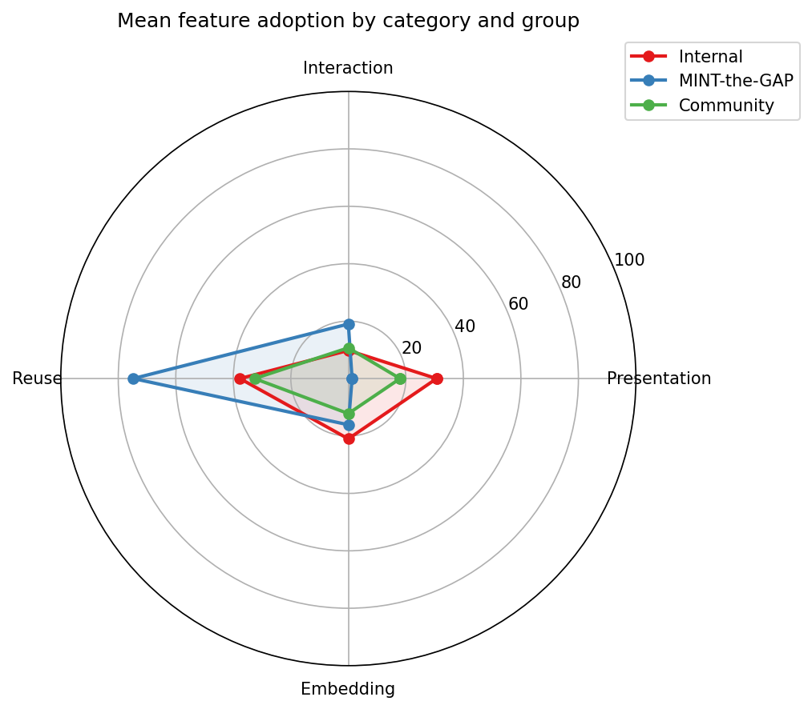

<!--
version:  1.0.0
language: de

narrator: Deutsch Female

tags: Vortrag, DELFI, LiaScript, OER, Feature-Adoption, Korpusanalyse

comment:  Designed but Not Used? — Feature-Adoption in einem System ohne
          Telemetrie. Vortrag auf der DELFI 2026.
          Vortragende: Sebastian Zug, André Dietrich, Ines Aubel
          (TU Bergakademie Freiberg).

author:   Sebastian Zug, André Dietrich, Ines Aubel, Martin Lommatzsch, Volker Göhler

import: https://raw.githubusercontent.com/LiaTemplates/LiveEdit-Embeddings/refs/tags/0.0.1/README.md

persistent: true

edit: true

@style
.cols {
  display: flex;
  flex-wrap: wrap;
  align-items: center;
  justify-content: space-between;
  gap: 2rem;
}

.cols > * {
  flex: 1;
  min-width: 280px;
}

.bigfact {
  text-align: center;
  padding: 1.2rem 0;
}

.bigfact .num {
  font-size: 3.4rem;
  font-weight: 700;
  line-height: 1.1;
  color: #2E86AB;
}

.bigfact .cap {
  font-size: 1.15rem;
  color: #555;
  margin-top: .4rem;
}
@end

-->

[](https://liascript.github.io/course/?https://raw.githubusercontent.com/LiaPlayground/DELFI_2026_presentation/main/README.md)

# Designed but Not Used?

<h2>Feature-Adoption in einem System ohne Telemetrie</h2>

<h4>Sebastian Zug, André Dietrich, Ines Aubel, Martin Lommatzsch, Volker Göhler</h4>

<h4>TU Bergakademie Freiberg · Geschwister-Scholl-Gymnasium Freiberg</h4>

<div class="cols">
<div>

> __DELFI 2026 — Die 24. Fachtagung Bildungstechnologien__
>
> __September 2026__

Dieser Foliensatz steht unter einer Creative-Commons-Lizenz (CC BY 4.0). Der Quelltext liegt auf [GitHub](https://github.com/LiaPlayground/DELFI_2026_presentation).

</div>
<div>


</div>
</div>

---

--{{0}}--
Herzlich willkommen. Wir haben ein Werkzeug gebaut, das bewusst keine Daten
über seine Nutzung sammelt — und stehen damit vor einem Problem: Wir wissen
nicht, was die Leute damit tun. In den nächsten zwanzig Minuten zeige ich
Ihnen, wie wir das trotzdem herausgefunden haben, und was dabei für unsere
eigenen Workshops herauskam.

## Was Sie hier gerade sehen

> [!IMPORTANT]
> **Dieser Vortrag ist selbst ein LiaScript-Dokument und damit eine Textdatei.**

Eine einzige Markdown-Datei, die in Ihrem Browser gerendert wird. Kein Server,
keine Installation, kein Konto.

--{{0}}--
Was Sie gerade sehen, ist selbst ein LiaScript-Kurs — genau das Werkzeug, über
das wir gleich sprechen. Keine Präsentationssoftware, sondern eine Textdatei,
die Ihr Browser darstellt.

# Teil 1 — LiaScript

> [!IMPORTANT]
> **LiaScript ist Markdown — erweitert um genau die Elemente, die für
> interaktive Lehre fehlen.**

--{{0}}--
Zunächst kurz: Was ist LiaScript überhaupt? Für alle, die es noch nicht kennen.

## Ein Kurs ist ein Text

> __Alles wird als reiner Text geschrieben. Probieren Sie es aus — links
> ändern, rechts zusehen.__

```markdown @embed.style(height: 520px; min-width: 100%; border: 1px black solid)
# Sortierverfahren

Ein Verfahren ist **effizient**, wenn es mit wachsender Datenmenge
nicht ~~überproportional~~ langsamer wird.

Bubble Sort benötigt $\mathcal{O}(n^2)$ Vergleiche.

| Verfahren   | Vergleiche              | stabil |
| ----------- |:-----------------------:| ------:|
| Bubble Sort | $\mathcal{O}(n^2)$      | ja     |
| Merge Sort  | $\mathcal{O}(n \log n)$ | ja     |

Welches Verfahren ist **nicht** stabil?

[( )] Bubble Sort
[(X)] Quick Sort
[( )] Merge Sort
```

--{{0}}--
Links der Quelltext, rechts das Ergebnis. Formatierung, Mathematik, Tabellen
und Quizze — alles in einer Textdatei, alles sofort im Browser. Genau diese
Bausteine sind es, deren Nutzung wir später vermessen.

## Sovereignty by Design

<div class="cols">
<div>

- **kein Server** → keine Logs
- **keine Accounts** → keine Nutzerprofile
- **keine Telemetrie** → keine Nutzungsdaten

</div>
<div>

> __Autor:innen behalten die volle Kontrolle über ihre Inhalte.__
>
> Wir wissen dafür **nicht**, wie LiaScript verwendet wird.

</div>
</div>

--{{0}}--
Das ist eine bewusste Designentscheidung: keine Server, keine Konten, keine
Telemetrie. Für offene Bildungsressourcen ist das genau richtig. Aber es hat
einen Preis — und der ist der Ausgangspunkt dieses Papers.

## Die Community wächst


<div class="bigfact">
<div class="num">293</div>
<div class="cap">Autor:innen · 5.042 Kurse (Stand August 2026)</div>
</div>

--{{0}}--
Und es wird benutzt. Seit 2017 wächst die Zahl der Kurse und Autorinnen
exponentiell. Inzwischen sind es fast dreihundert unabhängige Autor:innen.
Das ist keine Werkzeugnutzung mehr, das ist eine Community.

     {{1}}
> Die blaue Fläche ist **ein einziges Projekt**. Merken Sie sich das.

--{{1}}--
Eine Sache fällt auf: Diese blaue Fläche ab 2025 ist kein Community-Wachstum,
sondern ein einzelnes Projekt mit über tausend Kursen. Merken Sie sich das,
wir kommen darauf zurück.

# Teil 2 — Das Problem

> [!IMPORTANT]
> **Wir bauen Workshops und Tutorials. Für wen eigentlich?**

--{{0}}--
Jetzt zum eigentlichen Problem — und das ist kein LiaScript-Problem, sondern
eines, das viele von Ihnen kennen dürften.

## Entscheidungen ohne Datengrundlage

Wir führen regelmäßig Workshops durch — und entscheiden dabei laufend:

     {{0}}
- Welche Features zeigen wir zuerst?
- Was lassen wir weg?
- Wo hakt es in der Praxis?

     {{1}}
> [!WARNING]
> **Bisher: Bauchgefühl.**

--{{0}}--
Bei jedem Workshop stellt sich dieselbe Frage: Womit fangen wir an? Was ist
wichtig, was können wir weglassen? Und ehrlicherweise haben wir das bisher
nach Gefühl entschieden.

--{{1}}--
Wir hatten schlicht keine Grundlage für diese Entscheidungen.

## Eine Frage an Sie

<div class="bigfact">
<div class="cap">Wer von Ihnen entwickelt Lehrmaterial oder Werkzeuge,<br>
<b>ohne</b> zu wissen, wie sie tatsächlich genutzt werden?</div>
</div>

     {{1}}
> [!NOTE]
> Genau dieses Problem haben dezentrale, datensparsame Systeme —
> strukturell und dauerhaft.

--{{0}}--
Kurze Frage in die Runde — und ich vermute, es gehen einige Hände hoch.

--{{1}}--
Das ist der Punkt: Datensparsamkeit und Wissen über die eigene Nutzerschaft
stehen in einem echten Zielkonflikt. Wer das eine will, verliert das andere.

# Teil 3 — Methodik

> [!IMPORTANT]
> **Kurse liegen in öffentlichen Repositories. Das ist der einzige Kanal,
> über den wir Nutzung beobachten können.**

--{{0}}--
Unser Ausweg: Wenn wir die Nutzung nicht messen können, schauen wir uns an,
was die Leute veröffentlichen.

## Der Korpus

<div class="cols">
<div>

| | |
|---|---|
| Validierte Kurse | **3.317** |
| Autor:innen | **314** |
| Stand | März 2026 |

</div>
<div>

> [!WARNING]
> **Wichtige Einschränkung**
>
> Wir messen *author adoption* — welche Features Autor:innen **einbauen**.
> Nicht, was Lernende damit tun.

</div>
</div>

     {{1}}
Vier didaktisch motivierte Kategorien, **44 Features**:
**Presentation** · **Interaction** · **Reuse** · **Embedding**

--{{0}}--
Wir haben gut dreitausend validierte Kurse von GitHub eingesammelt und jeden
daraufhin untersucht, welche der vierundvierzig LiaScript-Features darin
vorkommen. Eine wichtige Einschränkung gleich vorweg: Wir sehen, was
Autor:innen einbauen — nicht, was Lernende davon tatsächlich nutzen.

# Teil 4 — Ergebnisse

--{{0}}--
Kommen wir zu den Ergebnissen — und die erste Zahl hat uns selbst überrascht.

## Die gute Nachricht

<div class="bigfact">
<div class="num">89 %</div>
<div class="cap">des Feature-Raums werden messbar genutzt</div>
</div>

Nur **5 von 44** Features liegen unter 1 %.

     {{1}}
> [!NOTE]
> Das Problem ist also **nicht**, dass Features ungenutzt bleiben.

--{{0}}--
Neunundachtzig Prozent der Features werden in messbarem Umfang eingesetzt.
Nur fünf von vierundvierzig liegen unter einem Prozent. Unsere Sorge, große
Teile der Sprache seien tote Buchstaben, war unbegründet.

--{{1}}--
Die eigentliche Erkenntnis liegt woanders.

## Jede Gruppe nutzt ihr eigenes Subset



--{{0}}--
Denn sobald man den Korpus nach Autorengruppen aufteilt, zerfällt das Bild.
Jede Gruppe bewegt sich in ihrem eigenen Ausschnitt der Sprache.

## Hochschule und Schule — gegenläufig

| Feature | Comm-Uni | Comm-School |
|---|---:|---:|
| Narrator | **88,5 %** | 60,8 % |
| Code-Blöcke | **53,7 %** | 28,5 % |
| WebApps | 4,8 % | **24,2 %** |
| Logo / Branding | 21,4 % | **57,0 %** |

     {{1}}
> Gleiche Sprache. Zwei Communities. **Entgegengesetzte Schwerpunkte.**

--{{0}}--
Am deutlichsten wird das beim Vergleich von Hochschule und Schule. Die einen
setzen auf Sprachausgabe und Code, die anderen auf Medien und visuelle
Gestaltung. Dieselbe Sprache, zwei fast gegenläufige Profile.

## Zwischenfrage

Welches Feature nutzen **Schul**-Autor:innen deutlich häufiger
als Autor:innen an Hochschulen?

[( )] Narrator
[( )] Code-Blöcke
[(X)] WebApps und visuelles Branding
[( )] ASCII-Diagramme
****************************************

Schulische Kurse setzen auf **Medien und Gestaltung**,
Hochschulkurse auf **narrativen Text und Code**.

****************************************

--{{0}}--
Kurze Zwischenfrage — was meinen Sie?

## Ein Beispiel aus dem September

<div class="cols">
<div>

Ein Grundschulkurs, Sachunterricht Klasse 4:

- **24 Aufgaben**, 21 Quizze, 28 Bilder
- kein Narrator, keine Makros, keine Imports
- **35 MB Bilder** im Repository

</div>
<div>

```markdown
<!--
author: Adrian Nemetschek
language: de
-->
```

__Das ist der komplette Header.__

</div>
</div>

     {{1}}
> [!NOTE]
> Die Hürde liegt **früher**, als wir dachten: nicht bei komplexen Features,
> sondern beim Bildhandling.

--{{0}}--
Wie das konkret aussieht, zeigt ein Kurs, der erst vor wenigen Tagen
entstanden ist. Zwei Zeilen Konfiguration, vierundzwanzig Aufgaben, viele
Bilder — und sonst nichts. Genau das Schulprofil aus der Tabelle.

--{{1}}--
Bemerkenswert sind die fünfunddreißig Megabyte Bilder, davon der größte Teil
gar nicht verwendet. Niemand hat dem Autor gesagt, dass man Bilder für das Web
verkleinert. Das ist kein Vorwurf — das ist eine Lücke in unserem Onboarding.

## Infrastruktur schlägt Didaktik

Erinnern Sie sich an die blaue Fläche?

<div class="cols">
<div>

> __MINT-the-GAP__
>
> Ein Schulprojekt mit einheitlichem Template.

</div>
<div>

Makros **99,7 %** · Imports **98,3 %**

Narrator **9,4 %** · Animationen **0,6 %**

</div>
</div>

     {{1}}
> [!IMPORTANT]
> Eine geteilte Konfiguration hebt alles **in ihrem Rahmen** —
> und lässt alles außerhalb unberührt.

--{{0}}--
Und hier kommt die blaue Fläche von vorhin zurück. Ein einzelnes Schulprojekt
mit einem gemeinsamen Template. Die Features, die im Template stecken, liegen
bei nahezu hundert Prozent. Alles andere bei fast null.

--{{1}}--
Die Autoren dort haben keine didaktische Entscheidung gegen Sprachausgabe
getroffen. Sie ist in ihrer Vorlage schlicht nicht vorgesehen. Infrastruktur
prägt Adoption mindestens so stark wie Didaktik.

## Konsequenz für unsere Tutorials

Die Gruppen steigen auf **unterschiedlichen Leitern** ein:

     {{1}}
**Hochschule:** Narrator → Code & Makros → *stockt bei Animationen*

     {{2}}
**Schule:** visuelle Medien → Quizze → *erreicht Code kaum*

     {{3}}
> [!IMPORTANT]
> **Ein linearer Tutorial-Pfad ist deshalb falsch.**
>
> Onboarding muss dort ansetzen, wo die jeweilige Gruppe steht.

--{{0}}--
Was heißt das nun für unsere eigene Arbeit?

--{{1}}--
Hochschulautoren beginnen bei Sprachausgabe und Text, gehen weiter zu Code und
Makros — und bleiben bei Animationen stehen.

--{{2}}--
Schulische Autoren starten bei Bildern und Medien, kommen über Quizze — und
erreichen Code praktisch nie.

--{{3}}--
Das ist die zentrale Konsequenz: Ein einziger, linearer Einführungskurs geht an
beiden Gruppen vorbei. Wir brauchen kontextspezifische Einstiege — und genau
das ändern wir gerade an unseren Workshops.

## Zusammengefasst

- **89 %** des Feature-Raums werden genutzt — das ist nicht das Problem
- Jede Community erkundet nur **ihr eigenes Subset**
- **Autoren-Infrastruktur** prägt Adoption so stark wie Didaktik
- Onboarding braucht **kontextspezifische Einstiege**

     {{1}}
> Ein Korpus ist bei fehlender Telemetrie ein **tragfähiger Proxy** —
> wiederholbar, ohne die Datensparsamkeit aufzugeben.

--{{0}}--
Zusammengefasst: Das Problem ist nicht, dass Features ungenutzt bleiben,
sondern dass jede Gruppe nur ihren Ausschnitt kennt. Und die Infrastruktur,
mit der Autoren arbeiten, prägt das mindestens so stark wie ihre Didaktik.

--{{1}}--
Und methodisch: Man kann die Nutzung eines datensparsamen Systems untersuchen,
ohne die Datensparsamkeit aufzugeben. Der Korpus ist ein Proxy — aber ein
tragfähiger.

## Vielen Dank

<div class="cols">
<div>

__Diesen Vortrag öffnen:__

[qr-code](https://liascript.github.io/course/?https://raw.githubusercontent.com/LiaPlayground/DELFI_2026_presentation/main/README.md "Diesen Vortrag im Browser öffnen")

</div>
<div>

**Fragen?**

sebastian.zug@informatik.tu-freiberg.de

__Quelltext:__
<https://github.com/LiaPlayground/DELFI_2026_presentation>

__Datensatz:__
`LiaPlayground/liascript-adoption-dataset`

</div>
</div>

--{{0}}--
Vielen Dank für Ihre Aufmerksamkeit. Den Foliensatz können Sie über den
QR-Code direkt öffnen — er ist selbst ein LiaScript-Kurs, Sie können ihn also
sofort editieren und weiterverwenden. Der Datensatz liegt ebenfalls offen.
Ich freue mich auf Ihre Fragen.
