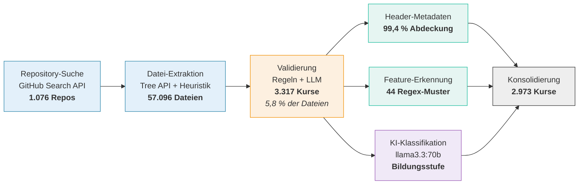

<!--
version:  2.4.0
language: de

narrator: Deutsch Female

tags: Vortrag, DELFI, LiaScript, OER, Feature-Adoption, Korpusanalyse

comment:  Designed but Not Used? — Feature Adoption Analysis of
          LiaScript Courses.
          Vortrag auf der DELFI 2026.
          Sprecher: Sebastian Zug (TU Bergakademie Freiberg)

author:   Sebastian Zug, André Dietrich, Ines Aubel, Martin Lommatzsch, Volker Göhler

import: https://raw.githubusercontent.com/LiaTemplates/LiveEdit-Embeddings/refs/tags/0.0.1/README.md
import: https://raw.githubusercontent.com/LiaTemplates/mermaid_template/0.1.4/README.md

persistent: true

edit: true

@style
.cols {
  display: flex;
  flex-wrap: wrap;
  align-items: center;
  justify-content: space-between;
  gap: 2rem;
}

.cols > * {
  flex: 1;
  min-width: 280px;
}

.bigfact {
  text-align: center;
  padding: 1.2rem 0;
}

.bigfact .num {
  font-size: 3.4rem;
  font-weight: 700;
  line-height: 1.1;
  color: #2E86AB;
}

.bigfact .cap {
  font-size: 1.15rem;
  color: #555;
  margin-top: .4rem;
}

@end

-->

[](https://liascript.github.io/course/?https://raw.githubusercontent.com/LiaPlayground/DELFI_2026_presentation/main/README.md)

# Designed but Not Used?

<h2>A Feature Adoption Analysis of LiaScript Courses</h2>

<div class="cols">
<div>

> __DELFI 2026 — Die 24. Fachtagung Bildungstechnologien__
>
> __Potsdam, September 2026__


</div>
<div>

> **Sebastian Zug$^1$, André Dietrich$^1$, Ines Aubel$^1$, Martin Lommatzsch$^2$, Volker Göhler$^1$**
>
> **$^1$TU Bergakademie Freiberg, $^2$Geschwister-Scholl-Gymnasium Freiberg**


</div>
</div>

<div class="cols">
<div>

Das zugehörige Paper finden Sie in der Digitalen Bibliothek der GI unter [Link](https://dl.gi.de/items/4da2a537-6a46-4f90-9276-618d41e8409b)

<!-- style="height:250px" -->

</div>
<div>

Dieser Vortrag ist unter folgenden [Link](https://liascript.github.io/course/?https://raw.githubusercontent.com/LiaPlayground/DELFI_2026_presentation/main/README.md) zu finden.

[qr-code](https://liascript.github.io/course/?https://raw.githubusercontent.com/LiaPlayground/DELFI_2026_presentation/main/README.md)

</div>
</div>

---

Dieser Foliensatz steht unter einer Creative-Commons-Lizenz (CC BY 4.0). Der Quelltext liegt auf [GitHub](https://github.com/LiaPlayground/DELFI_2026_presentation).

--{{0}}--
Der Vortrag gliedert sich in vier Teile: LiaScript und Ausgangslage, das
methodische Problem der bewussten Datensparsamkeit, Korpusaufbau und
Ergebnisse sowie die Konsequenzen für die eigene Workshopgestaltung.

## Was ist LiaScript?

> [!TIP]
> **LiaScript ist Markdown — erweitert um genau die Elemente, die für interaktive Lehre fehlen. Dabei bleibt alles ein Text - den man beliebig verändern und kopieren kann.**

--{{0}}--
Für alle, die LiaScript noch nicht kennen: Ein Kurs ist eine einzelne
Markdown-Datei. Die Auszeichnungssprache erweitert Standard-Markdown um
Elemente, die für interaktive Lehre erforderlich sind — und bleibt dabei
durchgängig Text, der kopiert, versioniert und weitergegeben werden kann.

````markdown @embed.style(height: 520px; min-width: 100%; border: 1px black solid)
<!--
import: https://raw.githubusercontent.com/liaTemplates/ABCjs/main/README.md
-->
# TU Bergakademie Freiberg

**Standard Markdown**

Die Bergakademie wurde **1765** gegründet und ist damit die älteste noch bestehende ~~Montanuniversität~~.

**Quizz**

Welches mit `G` beginnende Element wurde in Freiberg entdeckt?
[[ Germanium ]]
******

Richtig! 1886 war das.

******

**Interaktion**

``` abc
X:353
T: GLUECK AUF DER STEIGER KOEMMT
N: E1512
O: Europa, Mitteleuropa, Deutschland
R: Staende -, Bergmanns - Lied
M: 4/4
L: 1/16
K: G
| G8F4A4 | G8z8 | B8A4c4 | B8z4G2A2 | B4B4B4A2B2 | c4A3AA4
A2B2 | c4c4c4B2c2 | d4B3BB4A4 | G8F8 | G4e4d4c2A2 | B8A8 | G8z8
```
@ABCJS.eval

??[Familienschacht Freiberg](https://sketchfab.com/3d-models/familienschacht-freiberg-germany-7c7d30506c554385a4a4321366e2e601 "Quelle: sketchfab.com")
````

--{{0}}--
Links der Quelltext, rechts das gerenderte Ergebnis. Das Beispiel zeigt vier
Ebenen: Standard-Markdown, ein Quiz in LiaScript-Syntax, eine per Template
eingebundene Notendarstellung und ein eingebettetes 3D-Modell. Die Verbreitung
solcher Elemente wird im Folgenden quantifiziert.

### Sovereignty by Design

> [!IMPORTANT]
> LiaScript Dokumente werden im Browser interpretiert - die Ausführungsumgebung läuft lokal.

<div class="cols">
<div>

- **kein Server** → keine Logs
- **keine Accounts** → keine Nutzerprofile
- **keine Telemetrie** → keine Nutzungsdaten

</div>
<div>

> __Autor:innen behalten die volle Kontrolle über ihre Inhalte bzw. teilen diese sehr einfach.__
>
> Wir wissen dafür **nicht**, wie LiaScript verwendet wird.

</div>
</div>

--{{0}}--
Die dezentrale Struktur von LiaScript ist eine bewusste Designentscheidung: keine Server, keine Konten, keine
Telemetrie. Für offene Bildungsressourcen ist das genau richtig.
Damit haben wir aber auch keinen Rückgriff auf Nutzungsverhalten und Nutzungsmuster.

### Die Community wächst ...


<div class="bigfact">
<div class="num">5.042</div>
<div class="cap">Kurse in 293 Repository-Accounts · Stand August 2026</div>
</div>

> __... und damit die Nachfrage nach Tutorials und Workshops.__

--{{0}}--
Die Zahl öffentlich verfügbarer Kurse wächst seit 2017 kontinuierlich: im
August 2026 gut fünftausend Kurse in knapp dreihundert Accounts. Die blau
markierte Fläche entfällt auf ein einzelnes Projekt, 2026 ist nur bis August
erfasst. Mit der Verbreitung steigt die Nachfrage nach
Einführungsveranstaltungen.

## Das Problem

> [!IMPORTANT]
> **Wer ist eigentlich die Zielgruppe und welche Feature sollten dort fokussiert werden?**

<details>
<summary>Sachkundeunterricht Klasse 4 - Adrian Nemetschek - ([Link zum Material](https://github.com/aua-einiges/LiaScript_Sachunterricht_Lernbereich3/blob/main/DL_Sachunterricht1_Nem%20(1).md)</summary>

<iframe
  src="https://liascript.github.io/course/?https://raw.githubusercontent.com/aua-einiges/LiaScript_Sachunterricht_Lernbereich3/main/DL_Sachunterricht1_Nem%20(1).md#3"
  style="width:100%; height:80vh; border:1px solid #ccc"
  allowfullscreen>
</iframe>

</details>

<details>
<summary>Fonts Template für wissenschaftliche Community - André Dietrich - ([Link zum Material](https://liascript.github.io/course/?https://raw.githubusercontent.com/LiaPlayground/Fonts/main/README.md#6))</summary>

<iframe
  src="https://liascript.github.io/course/?https://raw.githubusercontent.com/LiaPlayground/Fonts/main/README.md#2"
  style="width:100%; height:80vh; border:1px solid #ccc"
  allowfullscreen>
</iframe>

</details>

> [!TIP]
> __Die Vermutung, dass unterschiedliche Anwendungskontexte eine verschiedene Nutzungsmuster zeigen ist offensichtlich, aber wie können wir das nachweisen?__

--{{0}}--
Die Beispiele stehen für unterschiedliche Anwendungskontexte: ein
Grundschulkurs mit Bildern und Auswahlaufgaben, ein Template für die
wissenschaftliche Community. Beide nutzen dieselbe Sprache, aber erkennbar
unterschiedliche Teilmengen ihrer Merkmale. Offen bleibt der belastbare
Nachweis, da Rückmeldungen nur unsystematisch vorliegen.

## Methodik

> [!IMPORTANT]
> **Kurse liegen in öffentlichen Repositories. Das ist der einzige Kanal, über den wir Nutzung beobachten können.**

<details>

<summary>LiaScript Gehversuche - Irina Feldbrügge - ([Link zum Material](https://liascript.github.io/course/?https://raw.githubusercontent.com/LiaPlayground/Fonts/main/README.md#6))</summary>

<iframe
  src="https://liascript.github.io/course/?https://raw.githubusercontent.com/IRFE2023/LIASCRIPT/refs/heads/main/warum.md#1"
  style="width:100%; height:80vh; border:1px solid #ccc"
  allowfullscreen>
</iframe>

</details>

> [!TIP]
> Die manuelle Erfassung der Rückmeldungen der Nutzenden ist offenbar kein geeignetes Vorgehensmodell.

--{{0}}--
Einzelne Rückmeldungen wie diese sind aufschlussreich, aber sie entstehen
zufällig und sind nicht repräsentativ. Für eine systematische Aussage
benötigen wir eine andere Datengrundlage. Da LiaScript keine Telemetrie
erhebt, bleibt als einziger Beobachtungskanal das, was Autorinnen und Autoren
öffentlich publizieren: ihre Kurse in offenen Repositories.

### Der Korpus

> Für die Erfassung der Daten wurden die offenen LiaScript Materialsammlungen durchsucht.



<div class="cols">
<div>

<!-- data-type="none" -->
| | |
|---|---|
| Validierte Kurse | **3.317** |
| Committer | **314** |
| Repository-Accounts | **205** |
| Stand | **März 2026** |

*Die Analyse nutzt den Stand von März 2026 — der Korpus ist seither
weiter gewachsen.*

</div>
<div>

> [!WARNING]
> **Wichtige Einschränkung**
>
> Wir messen *author adoption* — welche Features Autor:innen **einbauen**.
> Nicht, was Lernende damit tun.

</div>
</div>

--{{0}}--
Eine Repository-Suche liefert gut tausend Kandidaten mit rund
siebenundfünfzigtausend Markdown-Dateien; nach regelbasierter und
LLM-gestützter Validierung verbleiben dreitausenddreihundertsiebzehn Kurse.
Zwei Einschränkungen: Die Analyse beruht auf dem Stand von März 2026, und
erhoben wird ausschließlich *author adoption* — über die Nutzung durch
Lernende erlaubt der Korpus keine Aussage.

### Inhalte der Kurse

Nicht jede Gruppe von Autor:innen ist vergleichbar — wir trennen daher
zuerst nach **Repository-Kontext**, dann nach **Bildungsstufe**:

<!-- data-type="none" -->
| Gruppe | Kurse | Accounts | Charakter |
|---|---:|---:|---|
| **Internal** | 462 | 7 | Kernteam: Templates, Demos, eigene Lehre |
| **MINT-the-GAP** | 1.147 | 1 | Eine Schulinitiative, strukturierte MINT-Kurse |
| **Comm-Uni** | 1.178 | 167 | Community, Hochschule — größte & vielfältigste Gruppe |
| **Comm-School** | 186 | 38 | Community, Schule (Primar & Sekundar) |

> [!NOTE]
> **Warum trennen?** MINT-the-GAP stellt fast ein Drittel aller Kurse aus
> **einem** Account — ohne Trennung würde diese Initiative jede Aussage
> über „die Community" dominieren.

     {{2}}
> Weitere **344 Kurse** (Berufs-/Weiterbildung oder ohne klare Zuordnung)
> bleiben außen vor → **2.973 Kurse** im Gruppenvergleich.

--{{0}}--
Die LiaScript-Community zeigt sich ausgesprochen heterogen. Der
Clusteringansatz, den wir für die Klassifikation gewählt haben, erfolgt
zweistufig: nach Repository-Kontext und innerhalb der Community nach
Bildungsstufe. Ausschlaggebend ist MINT-the-GAP mit über tausend Kursen —
knapp einem Drittel des Korpus. Ohne diese Trennung beschriebe jede Aussage
faktisch dieses eine Projekt.

--{{2}}--
344 Kurse entfallen auf Berufs- und Weiterbildung oder
lassen sich nicht eindeutig zuordnen. Sie bleiben im Gruppenvergleich
unberücksichtigt, sodass sich die Grundgesamtheit von 3.317
auf 2.973 Kurse reduziert.

### Merkmalskategorisierung

**44 binäre Merkmale**, erhoben über Muster im Markdown-Quelltext —
gruppiert nach der **didaktischen Barriere**, die sie adressieren:

| Kategorie | Entwurfsabsicht | Beispiele |
|---|---|---|
| <span style="color:#4393c3">**Presentation**</span> | Selbstgesteuert & barrierearm | Narrator (TTS), Animationen, Effekte, Galerien |
| <span style="color:#d6604d">**Interaction**</span> | Aktives Lernen & Rückmeldung | Quiz-Typen, Texteingabe, Umfragen |
| <span style="color:#4dac26">**Reuse**</span> | Skalierbares Autor:innenhandwerk | Imports, eigene Makros, Templates |
| <span style="color:#998ec3">**Embedding**</span> | Ausführbare Umgebungen | Code-Ausführung, WebApps, Skripte |

     {{1}}
> [!WARNING]
> Erfasst wird **Vorhandensein, nicht Anzahl**: Ein Kurs mit einem
> einzigen Quiz zählt wie ein quizzentrierter Kurs.

--{{0}}--
Die vierundvierzig Merkmale werden über Mustererkennung im Quelltext erhoben.
Die Gruppierung folgt nicht technischer Verwandtschaft, sondern der
adressierten didaktischen Hürde: Presentation der Zugänglichkeit, Interaction
dem Selbsttest ohne Lernplattform, Reuse dem Don't-Repeat-Yourself-Prinzip,
Embedding dem eigenen Ausprobieren.

--{{1}}--
Eine Einschränkung zur Interpretation der Prozentwerte: Erhoben wird das
Vorkommen eines Features, nicht seine Zentralität. Die Zahlen beschreiben die
Reichweite eines Features, nicht die Intensität seiner Nutzung.

## Analyse

<div class="bigfact">
<div class="num">89 %</div>
<div class="cap">des Feature-Raums werden messbar genutzt</div>
</div>

Nur **5 von 44** Merkmalen bleiben unter 1 %:

     {{1}}
| Merkmal | Anteil |
|---|---:|
| Effects | 0,00 % |
| Classroom | 0,03 % |
| TTS blocks | 0,06 % |
| Code projects | 0,42 % |
| Animated CSS | 0,69 % |

     {{2}}
> [!NOTE]
> Das Problem ist also **nicht**, dass Merkmale ungenutzt bleiben.

--{{0}}--
Neunundachtzig Prozent des Merkmalsraums werden in messbarem Umfang
eingesetzt; die Annahme ungenutzter Sprachteile bestätigt sich nicht. Von
vierundvierzig Merkmalen liegen nur fünf unter einem Prozent. Die Schwelle
ist bewusst konservativ und markiert praktisch nicht vorkommende Merkmale,
nicht bloß seltene.

--{{2}}--
Die Herausforderung liegt demnach nicht in ungenutzten Merkmalen, sondern in
der Verteilung ihrer Nutzung — wie die folgenden Auswertungen zeigen.

### Adoptionsraten über alle Kurse

*Je Kategorie nach Rate sortiert. Merkmale über 10 % links, darunter rechts.
Auswahl aus 44 erhobenen Merkmalen, alle 3.317 Kurse.*

     {{0-1}}
*********************************************

| <span style="color:#4393c3">Presentation</span> | % | Rarely adopted | % |
|---|---:|---|---:|
| Narrator | 58,6 | Galleries | 7,3 |
| Animations | 22,8 | Animated CSS | 0,7 |
| TTS fragments | 11,6 | TTS blocks | 0,1 |
| Anim. blocks | 11,0 | Effects | 0,0 |

<span style="color:#4393c3">**Presentation**</span> — teilt sich scharf:
Narrator und Animationen mit geringem Aufwand breit genutzt,
feingranulare Text-to-Speech-Varianten (TTS) dagegen kaum.

*********************************************

     {{1-2}}
*********************************************

| <span style="color:#d6604d">Interaction</span> | % | Rarely adopted | % |
|---|---:|---|---:|
| Any quiz | 45,5 | Single choice | 9,0 |
| Text quiz | 28,8 | Selection quiz | 7,3 |
| Multiple choice | 10,2 | Quiz hints | 4,9 |
| | | Task lists | 4,7 |
| | | Surveys | 2,7 |
| | | Matrix quiz | 1,6 |

<span style="color:#d6604d">**Interaction**</span> — von einfachen Quizzen dominiert
(45,5 %); komplexe Matrix-Quiz und Umfragen werden kaum genutzt.

*********************************************

     {{2-3}}
*********************************************

| <span style="color:#4dac26">Reuse</span> | % | Rarely adopted | % |
|---|---:|---|---:|
| Macros (any) | 72,1 | Custom macros | 8,7 |
| Imports | 59,6 | | |
| Ext. scripts | 51,1 | | |

<span style="color:#4dac26">**Reuse**</span> — getragen von Imports und Makros:
Die meisten Autor:innen **konsumieren** geteilte Bausteine,
kaum jemand **definiert** eigene (8,7 %).

*********************************************


     {{3-4}}
*********************************************

| <span style="color:#998ec3">Embedding</span> | % | Rarely adopted | % |
|---|---:|---|---:|
| Math | 48,0 | ASCII diagrams | 9,8 |
| Script tags | 20,8 | WebApps | 5,6 |
| HTML embeds | 15,7 | Exec. code | 3,1 |
| Code-Ausf. (ges.) | 13,4 | Code projects | 0,4 |

<span style="color:#998ec3">**Embedding**</span> — streut am weitesten:
Mathematik erreicht 48 %, Code-Ausführung insgesamt 13,4 % — getragen
von **importierten Templates** (10,6 %), nicht von eigenem Code.

*********************************************

--{{0}}--
Links die Merkmale über zehn Prozent, rechts die darunter. Jede Kategorie hat
beide Seiten. Presentation teilt sich scharf: Der Narrator, eine Zeile im
Header, erreicht fast sechzig Prozent, die feineren TTS-Blöcke null Komma
eins. Nicht das Interesse fehlt, sondern die Sichtbarkeit der zweiten Stufe.

--{{1}}--
In der Kategorie Interaction dominieren einfache Quizformate: Knapp die Hälfte
aller Kurse enthält mindestens ein Quiz. Spezialisiertere Formate wie Umfragen
oder Matrix-Aufgaben bleiben dagegen deutlich unter fünf Prozent.

--{{2}}--
Besonders aufschlussreich ist die Kategorie Reuse. Imports und Makros werden
breit genutzt, eigene Makros definieren jedoch weniger als neun Prozent der
Kurse. Die Community konsumiert geteilte Bausteine in erheblichem Umfang,
produziert sie aber kaum selbst — ein Ansatzpunkt für infrastrukturelle
Unterstützung.

--{{3}}--
Embedding weist die größte Spannweite auf: Mathematik achtundvierzig Prozent.
Codeausführung erfolgt über drei Wege — At-Input drei Komma eins Prozent,
Code-Projekte null Komma vier, am häufigsten importierte Templates wie
Pyodide mit zehn Komma sechs. Zusammen dreizehn Komma vier Prozent. Wie bei
Reuse werden fertige Bausteine genutzt, kaum eigene erstellt.

### Adoptionsraten nach Gruppen

             {{0-1}}
*********************************************

Sobald man den Korpus nach Autorengruppen aufteilt, zerfällt das
aggregierte Bild — **kein Akteur führt durchgängig**:

| Kategorie | Feature | Internal | MINT | Comm-Uni | Comm-Sch. |
|---|---|---:|---:|---:|---:|
| <span style="color:#4393c3">Presentation</span> | Narrator | 86,6 | 9,4 | **88,5** | 60,8 |
| | TTS-Fragmente | **36,1** | 0,1 | 13,3 | 7,0 |
| | Animationen | **66,2** | 0,6 | 29,7 | 29,6 |
| | Logo | 41,1 | 0,3 | 21,4 | **57,0** |
| | Icon | 9,7 | 0,0 | 24,1 | **46,2** |
| <span style="color:#d6604d">Interaction</span> | Quiz (beliebig) | 22,7 | **78,3** | 28,3 | 43,0 |
| | Text-Quiz | 9,7 | **70,0** | 4,9 | 15,6 |
| | Auswahl-Quiz | 5,2 | 9,9 | 2,7 | **19,4** |
| | Multiple Choice | 11,3 | 0,8 | 17,2 | **18,3** |
| <span style="color:#4dac26">Reuse</span> | Makros | 69,0 | **99,7** | 52,6 | 58,6 |
| | Imports | 57,4 | **98,3** | 31,7 | 45,7 |
| | Externe Skripte | 16,2 | **96,3** | 31,8 | 25,8 |
| <span style="color:#998ec3">Embedding</span> | Code-Blöcke | **82,5** | 9,3 | 53,7 | 28,5 |
| | Mathematik | 30,7 | **95,2** | 21,4 | 32,8 |
| | ASCII-Diagramme | **38,5** | 2,3 | 8,3 | 5,4 |
| | HTML-Embeds | 20,4 | 5,9 | 20,5 | **39,2** |
| | WebApps | 13,0 | 0,7 | 4,8 | **24,2** |
| | Audio | **35,7** | 0,4 | 15,4 | 32,3 |

*Angaben in Prozent · Auswahl mit Spannweite > 10 pp · Zeilenmaximum **fett***

*********************************************

--{{0}}--
Dargestellt sind Merkmale mit mehr als zehn Prozentpunkten Gruppenunterschied;
der fette Wert markiert je Zeile das Maximum. Dieses wechselt zwischen den
Spalten — keine Gruppe führt durchgängig. Drei Zeilen sind aufschlussreich:
externe Skripte bei MINT-the-GAP mit sechsundneunzig Prozent, Code-Blöcke
beim Entwicklerteam mit zweiundachtzig, WebApps im Schulkontext.

     {{1-5}}
**Internal** — *Schaufenster*: führt bei code- und
präsentationsnahen Merkmalen; die Entwickler demonstrieren die
volle Sprachbreite.

     {{2-5}}
**MINT-the-GAP** — *Template-Werkstatt*: sättigt Reuse
(Makros 99,7 %, Imports 98,3 %) für kleine, abgeschlossene MINT-Aufgaben.
Alles außerhalb der Vorlage fehlt: Narrator 9,4 %, Animationen 0,6 %.

     {{3-5}}
**Comm-Uni** — *erzählend-textuell*: höchste Narrator-Quote (88,5 %),
dazu Code-Blöcke und Tabellen — vorlesungsnahe, textstarke Inhalte
mit wenig Multimedia.

     {{4-5}}
**Comm-School** — *multimedial-interaktiv*: genau umgekehrt —
visuelles Branding, eingebettete Medien, Auswahl-Quizze.
Engagement über Medienvielfalt statt über Code.

     {{4}}
> [!IMPORTANT]
> MINT-the-GAP und Comm-School zielen **beide auf Schule** — über
> entgegengesetzte Wege. Nicht der Bildungskontext allein bestimmt das
> Profil, sondern die **Autoren-Infrastruktur**.

--{{0}}--
Aus diesen Zahlen lassen sich vier Handschriften ablesen. Das Entwicklerteam
ist das Schaufenster: Es führt dort, wo es um Code und Präsentation geht —
was zu seiner Rolle als Demonstrator passt.

--{{1}}--
MINT-the-GAP ist die Template-Werkstatt. Reuse ist praktisch gesättigt, weil
jede Aufgabendatei denselben Satz Bibliotheken importiert. Und genau deshalb
fehlt alles, was nicht in der Vorlage steht.

--{{2}}--
Die Hochschule schreibt erzählend: höchste Narrator-Quote von allen, dazu
Code und Tabellen. Das ist die klassische Vorlesung, in Textform gebracht.

--{{3}}--
Die Schule macht das Gegenteil: Logos, Icons, eingebettete Medien,
Auswahl-Quizze. Engagement entsteht dort über Medienvielfalt, nicht über
Quelltext. Hierzu eine methodische Einschränkung: Comm-School ist die kleinste
Gruppe, und drei Accounts stellen vierundvierzig Prozent ihrer Kurse. Das
Profil kann daher teilweise die Handschrift einzelner produktiver Autorinnen
und Autoren abbilden.

--{{4}}--
Daraus folgt der zentrale Befund: MINT-the-GAP und die schulische Community
adressieren dieselbe Zielgruppe, weisen aber gegenläufige Merkmalsprofile auf.
Der Bildungskontext allein erklärt die Unterschiede demnach nicht — die
Autorenumgebung wirkt mindestens ebenso stark.

## Konsequenz für unsere Tutorials

                  {{0}}
***********************************************

> [!IMPORTANT]
> **Lehrende folgen kontextspezifischen Pfaden - ein linearer Tutorial-Pfad ist deshalb falsch.**
>
> Onboarding muss dort ansetzen, wo die jeweilige Gruppe steht.

--{{0}}--
Die Gruppenprofile zeigen zwei Einstiegspfade: im Hochschulkontext über
Sprachausgabe und Text hin zu Code und Makros, im Schulkontext über visuelle
Medien und Quizformate bei nahezu unerreichten codeorientierten Merkmalen. Da
produktive und gelegentliche Autor:innen ähnliche Profile aufweisen, spiegeln
die Grenzen den Anwendungskontext, nicht die Produktionsmenge.

***********************************************

                  {{1}}
***********************************************

<div class="cols">
<div>

<!-- data-type="none" -->
| Phase | Zeit | Idee |
|---|---:|---|
| **Erleben** | 20 min | Kurs aus **Lernendensicht** durchlaufen |
| **Verstehen** | 15 min | Konzepte hinter LiaScript |
| **Anwenden** | 50 min | Eigener Kurs im LiveEditor **mit individuellen Syntaxelementen** |
| **Verbreiten** | 15 min | Teilen, Schwerpunkt GitHub |

</div>
<div>

**Was die Studie dazu beigetragen hat**

- *Awareness-Lücke* → Phase 1 zeigt Merkmale, **bevor** man sie auswählen muss
- *Konsumieren statt Definieren* (8,7 %) → Template + Cheatsheet senken die Einstiegshürde
- *Workflow-Barriere* → Phase 4 macht das Publizieren zum eigenen Schritt

</div>
</div>

> [!IMPORTANT]
> Die Struktur ist eine **Neuentwicklung auf Basis dieser Ergebnisse** —
> mit **getrennten Einstiegen** für Schule und Hochschule.

--{{1}}--
Das Workshopkonzept umfasst seit Sommer 2026 vier Phasen mit überwiegendem Anteil eigener
Arbeit. Drei Befunde sind eingeflossen: Phase eins adressiert das
Awareness-Problem durch Kursdurchlauf aus Lernendenperspektive, Phase drei die
Diskrepanz zwischen Konsumieren und Definieren, und das Veröffentlichen
erhält als eigenständige Hürde eine eigene Phase. Erprobt im Mai und Juli
2026.

***********************************************

## Zukünftige Herausforderungen

**1 Vom Ergebnis zum Entstehungsprozess**
Wir untersuchen heute nur den **"Endstand"** eines Kurses. Die Commit-Historie
verrät, *wo* Autor:innen lange mit der Syntax gerungen haben — genau dort
liegen die realen Hürden.

**2 Didaktische Absicht deklarieren statt erraten**
Die Bildungsstufe ermitteln wir per KI-Klassifikation. Erweiterte
**standardisierte Metadaten** würden die Zuordnung überflüssig machen —
und wären zugleich für OER-Portale wertvoll.

**3 KI-generierte Inhalte mitdenken**
Schreibt ein Agent den Kurs, misst die Merkmalsanalyse **dessen Konfiguration** — nicht mehr die didaktische Entscheidung einer Person.

> [!WARNING]
> Der MINT-the-GAP-Effekt im Großen: Ein Template prägte 1.147 Kurse.
> Ein verbreiteter Agent prägt womöglich **alle**.

--{{0}}--
Drei offene Punkte. Der Korpus erfasst nur den Endstand; die Commit-Historie
würde die syntaktischen Hürden sichtbar machen. Die Bildungsstufe erfordert
derzeit ein Sprachmodell, das standardisierte Metadaten erübrigen würden.
Drittens misst eine Merkmalsanalyse bei KI-gestützter Kurserstellung
zunehmend die Konfiguration des Agenten — isolierbar nur, solange
Vergleichsgruppen existieren.

## Zusammengefasst

{{0-2}}
- **89 %** des Feature-Raums werden genutzt — das ist nicht das Problem
- Jede Community erkundet nur **ihr eigenes Subset**
- **Autoren-Infrastruktur** prägt Adoption so stark wie Didaktik
- Onboarding braucht **kontextspezifische Einstiege** —
  seit Sommer 2026 in unseren Workshops umgesetzt

--{{0}}--
Nicht die Breite der Adoption ist das Problem — neunundachtzig Prozent des
Merkmalsraums werden genutzt. Entscheidend ist, dass jede Autorengruppe nur
einen Ausschnitt erschließt und die eingesetzte Infrastruktur diesen
mindestens so stark prägt wie die didaktische Zielstellung. Daraus folgt die
Notwendigkeit kontextspezifischer Einstiege.

{{1-2}}
*************************************

<div class="cols">
<div>

[qr-code](https://liascript.github.io/course/?https://raw.githubusercontent.com/LiaPlayground/DELFI_2026_presentation/main/README.md "Diesen Vortrag im Browser öffnen")

</div>
<div>

**Fragen?**

sebastian.zug@informatik.tu-freiberg.de

__Quelltext:__
<https://github.com/LiaPlayground/DELFI_2026_presentation>

__Datensatz:__
`LiaPlayground/liascript-adoption-dataset`

</div>
</div>

*************************************

--{{1}}--
Vielen Dank für Ihre Aufmerksamkeit. Den Foliensatz können Sie über den
QR-Code direkt öffnen — er ist selbst ein LiaScript-Kurs, Sie können ihn also
sofort editieren und weiterverwenden. Der Datensatz liegt ebenfalls offen.
Ich freue mich auf Ihre Fragen.
