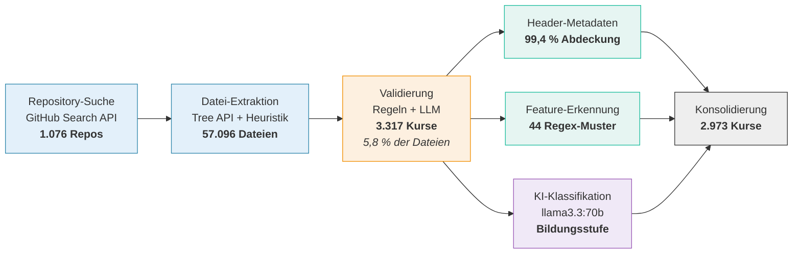

<!--
version:  1.0.0
language: de

narrator: Deutsch Female

tags: Vortrag, DELFI, LiaScript, OER, Feature-Adoption, Korpusanalyse

comment:  Designed but Not Used? — Feature-Adoption in einem System ohne
          Telemetrie. Vortrag auf der DELFI 2026.
          Vortragende: Sebastian Zug, André Dietrich, Ines Aubel
          (TU Bergakademie Freiberg).

author:   Sebastian Zug, André Dietrich, Ines Aubel, Martin Lommatzsch, Volker Göhler

import: https://raw.githubusercontent.com/LiaTemplates/LiveEdit-Embeddings/refs/tags/0.0.1/README.md
import: https://raw.githubusercontent.com/LiaTemplates/mermaid_template/0.1.4/README.md

persistent: true

edit: true

@style
.cols {
  display: flex;
  flex-wrap: wrap;
  align-items: center;
  justify-content: space-between;
  gap: 2rem;
}

.cols > * {
  flex: 1;
  min-width: 280px;
}

.bigfact {
  text-align: center;
  padding: 1.2rem 0;
}

.bigfact .num {
  font-size: 3.4rem;
  font-weight: 700;
  line-height: 1.1;
  color: #2E86AB;
}

.bigfact .cap {
  font-size: 1.15rem;
  color: #555;
  margin-top: .4rem;
}

@end

-->

[](https://liascript.github.io/course/?https://raw.githubusercontent.com/LiaPlayground/DELFI_2026_presentation/main/README.md)

# Designed but Not Used?

<h2>A Feature Adoption Analysis of LiaScript Courses</h2>

<div class="cols">
<div>

> __DELFI 2026 — Die 24. Fachtagung Bildungstechnologien__
>
> __Potsdam, September 2026__


</div>
<div>

> **Sebastian Zug$^1$, André Dietrich$^1$, Ines Aubel$^1$, Martin Lommatzsch$^2$, Volker Göhler$^1$**
>
> **$^1$TU Bergakademie Freiberg, $^2$Geschwister-Scholl-Gymnasium Freiberg**


</div>
</div>

<div class="cols">
<div>

Das zugehörige Paper finden Sie in der Digitalen Bibliothek der GI unter [Link](https://dl.gi.de/items/4da2a537-6a46-4f90-9276-618d41e8409b)

<!-- style="height:250px" -->

</div>
<div>

Dieser Vortrag ist unter folgenden [Link](https://liascript.github.io/course/?https://raw.githubusercontent.com/LiaPlayground/DELFI_2026_presentation/main/README.md) zu finden.

[qr-code](https://liascript.github.io/course/?https://raw.githubusercontent.com/LiaPlayground/DELFI_2026_presentation/main/README.md)

</div>
</div>

---

Dieser Foliensatz steht unter einer Creative-Commons-Lizenz (CC BY 4.0). Der Quelltext liegt auf [GitHub](https://github.com/LiaPlayground/DELFI_2026_presentation).

--{{0}}--
Herzlich willkommen. Diese Annotationen fassen die Erläuterungen zur
Vorstellung des Papers auf der DELFI 2026 zusammen. Der Vortrag gliedert sich
in vier Teile: Zunächst stellen wir LiaScript und die Ausgangslage vor, dann
das methodische Problem, das sich aus der bewussten Datensparsamkeit ergibt.
Darauf folgen Korpusaufbau und Merkmalserhebung sowie die Ergebnisse. Den
Abschluss bilden die Konsequenzen, die wir daraus für unsere eigenen
Workshops gezogen haben.

## Was ist LiaScript?

> [!TIP]
> **LiaScript ist Markdown — erweitert um genau die Elemente, die für
> interaktive Lehre fehlen. Dabei bleibt alles ein Text - den man beliebig verändern und kompieren kann.**

--{{0}}--
Für alle, die LiaScript noch nicht kennen: Ein Kurs ist eine einzelne
Markdown-Datei. Die Auszeichnungssprache erweitert Standard-Markdown um
Elemente, die für interaktive Lehre erforderlich sind — und bleibt dabei
durchgängig Text, der kopiert, versioniert und weitergegeben werden kann.

````markdown @embed.style(height: 520px; min-width: 100%; border: 1px black solid)
<!--
import: https://raw.githubusercontent.com/liaTemplates/ABCjs/main/README.md
-->
# TU Bergakademie Freiberg

**Standard Markdown**

Die Bergakademie wurde **1765** gegründet und ist damit die älteste noch bestehende ~~Montanuniversität~~.

**Quizz**

Welches mit `G` beginnende Element wurde in Freiberg entdeckt?
[[ Germanium ]]
******

Richtig! 1886 war das.

******

**Interaktion**

``` abc
X:353
T: GLUECK AUF DER STEIGER KOEMMT
N: E1512
O: Europa, Mitteleuropa, Deutschland
R: Staende -, Bergmanns - Lied
M: 4/4
L: 1/16
K: G
| G8F4A4 | G8z8 | B8A4c4 | B8z4G2A2 | B4B4B4A2B2 | c4A3AA4
A2B2 | c4c4c4B2c2 | d4B3BB4A4 | G8F8 | G4e4d4c2A2 | B8A8 | G8z8
```
@ABCJS.eval

??[Familienschacht Freiberg](https://sketchfab.com/3d-models/familienschacht-freiberg-germany-7c7d30506c554385a4a4321366e2e601 "Quelle: sketchfab.com")
````

--{{0}}--
Links sehen Sie den Quelltext, rechts das gerenderte Ergebnis; Änderungen
links wirken unmittelbar. Das Beispiel zeigt vier Ebenen: Standard-Markdown,
ein Quiz in LiaScript-Syntax, eine über ein Template eingebundene
Notendarstellung und ein eingebettetes 3D-Modell. Genau solche Elemente sind
die Merkmale, deren Verbreitung wir im Folgenden quantifizieren.

### Sovereignty by Design

> [!IMPORTANT]
> LiaScript Dokumente werden im Browser interpretiert - die Ausführungsumgebung läuft lokal. 

<div class="cols">
<div>

- **kein Server** → keine Logs
- **keine Accounts** → keine Nutzerprofile
- **keine Telemetrie** → keine Nutzungsdaten

</div>
<div>

> __Autor:innen behalten die volle Kontrolle über ihre Inhalte bzw. teilen diese sehr einfach.__
>
> Wir wissen dafür **nicht**, wie LiaScript verwendet wird.

</div>
</div>

--{{0}}--
Das ist eine bewusste Designentscheidung: keine Server, keine Konten, keine
Telemetrie. Für offene Bildungsressourcen ist das genau richtig. Aber es hat
einen Preis — und der ist der Ausgangspunkt dieses Papers.

### Die Community wächst ...


<div class="bigfact">
<div class="num">5.042</div>
<div class="cap">Kurse in 293 Repository-Accounts · Stand August 2026</div>
</div>

> __... und damit die Nachfrage nach Tutorials und Workshops.__

--{{0}}--
Die Zahl öffentlich verfügbarer Kurse wächst seit 2017 kontinuierlich; im
August 2026 sind es gut fünftausend Kurse in knapp dreihundert
Repository-Accounts. Zwei Hinweise zur Lesart: Die blau markierte Fläche
entfällt auf ein einzelnes Projekt, auf das wir später zurückkommen. Und das
Jahr 2026 ist nur bis August erfasst. Mit der Verbreitung steigt zugleich die
Nachfrage nach Einführungsveranstaltungen — womit sich die Frage stellt,
woran wir deren Inhalte eigentlich ausrichten.

## Das Problem

> [!IMPORTANT]
> **Wer ist eigentlich die Zielgruppe und welche Feature sollten dort fokussiert werden?**

<details>
<summary>Sachkundeunterricht Klasse 4 - Adrian Nemetschek - ([Link zum Material](https://github.com/aua-einiges/LiaScript_Sachunterricht_Lernbereich3/blob/main/DL_Sachunterricht1_Nem%20(1).md)</summary>

<iframe
  src="https://liascript.github.io/course/?https://raw.githubusercontent.com/aua-einiges/LiaScript_Sachunterricht_Lernbereich3/main/DL_Sachunterricht1_Nem%20(1).md#3"
  style="width:100%; height:80vh; border:1px solid #ccc"
  allowfullscreen>
</iframe>

</details>

<details>
<summary>Fonts Template für wissenschaftliche Community - André Dietrich - ([Link zum Material](https://liascript.github.io/course/?https://raw.githubusercontent.com/LiaPlayground/Fonts/main/README.md#6))</summary>

<iframe
  src="https://liascript.github.io/course/?https://raw.githubusercontent.com/LiaPlayground/Fonts/main/README.md#2"
  style="width:100%; height:80vh; border:1px solid #ccc"
  allowfullscreen>
</iframe>

</details>

> [!TIP]
> __Die Vermutung, dass unterschiedliche Anwendungskontexte eine verschiedene Nutzungsmuster zeigen ist offensichtlich, aber wie können wir das nachweisen?__

--{{0}}--
Die beiden Beispiele stehen für sehr unterschiedliche Anwendungskontexte: ein
Grundschulkurs zum Sachunterricht, der vorrangig mit Bildern und
Auswahlaufgaben arbeitet, und ein Template für die wissenschaftliche
Community, das typografische Möglichkeiten ausreizt. Beide nutzen dieselbe
Sprache, aber erkennbar unterschiedliche Teilmengen ihrer Merkmale. Dass
Anwendungskontexte zu verschiedenen Nutzungsmustern führen, ist insofern
naheliegend. Offen ist, wie sich das belastbar nachweisen lässt — denn
Rückmeldungen erreichen uns nur punktuell und unsystematisch.

## Methodik

> [!IMPORTANT]
> **Kurse liegen in öffentlichen Repositories. Das ist der einzige Kanal, über den wir Nutzung beobachten können.**

<details>

<summary>LiaScript Gehversuche - Irina Feldbrügge - ([Link zum Material](https://liascript.github.io/course/?https://raw.githubusercontent.com/LiaPlayground/Fonts/main/README.md#6))</summary>

<iframe
  src="https://liascript.github.io/course/?https://raw.githubusercontent.com/IRFE2023/LIASCRIPT/refs/heads/main/warum.md#1"
  style="width:100%; height:80vh; border:1px solid #ccc"
  allowfullscreen>
</iframe>

</details>

> [!TIP]
> Die manuelle Erfassung der Rückmeldungen der Nutzenden ist offenbar kein geeignetes Vorgehensmodell.

--{{0}}--
Einzelne Rückmeldungen wie diese sind aufschlussreich, aber sie entstehen
zufällig und sind nicht repräsentativ. Für eine systematische Aussage
benötigen wir eine andere Datengrundlage. Da LiaScript keine Telemetrie
erhebt, bleibt als einziger Beobachtungskanal das, was Autorinnen und Autoren
öffentlich publizieren: ihre Kurse in offenen Repositories.

### Der Korpus

> Für die Erfassung der Daten wurden die offenen LiaScript Materialsammlungen durchsucht.



<div class="cols">
<div>

<!-- data-type="none" -->
| | |
|---|---|
| Validierte Kurse | **3.317** |
| Committer | **314** |
| Repository-Accounts | **205** |
| Stand | **März 2026** |

*Die Analyse nutzt den Stand von März 2026 — der Korpus ist seither
weiter gewachsen.*

</div>
<div>

> [!WARNING]
> **Wichtige Einschränkung**
>
> Wir messen *author adoption* — welche Features Autor:innen **einbauen**.
> Nicht, was Lernende damit tun.

</div>
</div>

--{{0}}--
Die Aufbereitung erfolgt in vier Schritten. Eine Repository-Suche über die
GitHub-API liefert gut tausend Kandidaten, aus denen rund
siebenundfünfzigtausend Markdown-Dateien extrahiert werden. Die Validierung
kombiniert regelbasierte Indikatoren mit einem Sprachmodell für die unklaren
Fälle; es verbleiben dreitausenddreihundertsiebzehn Kurse, also knapp sechs
Prozent der Dateien. Anschließend laufen drei Zweige parallel:
Header-Metadaten, die Merkmalserkennung über Regex-Muster und eine
KI-gestützte Einordnung der Bildungsstufe.
Zwei Einschränkungen sind für die Interpretation wesentlich. Erstens beruht
die Analyse auf dem Stand von März 2026; der Korpus ist seither gewachsen.
Zweitens — und das ist die wichtigere Einschränkung — erfassen wir
ausschließlich *author adoption*: welche Merkmale Autorinnen und Autoren in
ihre Kurse aufnehmen. Über die tatsächliche Nutzung durch Lernende erlaubt
der Korpus keine Aussage.

### Inhalte der Kurse

Nicht jede Gruppe von Autor:innen ist vergleichbar — wir trennen daher
zuerst nach **Repository-Kontext**, dann nach **Bildungsstufe**:

<!-- data-type="none" -->
| Gruppe | Kurse | Accounts | Charakter |
|---|---:|---:|---|
| **Internal** | 462 | 7 | Kernteam: Templates, Demos, eigene Lehre |
| **MINT-the-GAP** | 1.147 | 1 | Eine Schulinitiative, strukturierte MINT-Kurse |
| **Comm-Uni** | 1.178 | 167 | Community, Hochschule — größte & vielfältigste Gruppe |
| **Comm-School** | 186 | 38 | Community, Schule (Primar & Sekundar) |

> [!NOTE]
> **Warum trennen?** MINT-the-GAP stellt fast ein Drittel aller Kurse aus
> **einem** Account — ohne Trennung würde diese Initiative jede Aussage
> über „die Community" dominieren.

     {{2}}
> Weitere **344 Kurse** (Berufs-/Weiterbildung oder ohne klare Zuordnung)
> bleiben außen vor → **2.973 Kurse** im Gruppenvergleich.

--{{0}}--
Bevor wir auf die Ergebnisse schauen, müssen wir eine Entscheidung erklären.
Wir können nicht einfach über „die LiaScript-Community" sprechen, denn die
Autor:innen haben sehr unterschiedliche Beziehungen zum Werkzeug. Deshalb
trennen wir in zwei Schritten: zuerst nach Repository-Kontext — wer gehört
zum Entwicklerteam, wer ist eine eigene Initiative — und innerhalb der
übrigen Community nach Bildungsstufe, also Hochschule oder Schule.
Ausschlaggebend ist dabei MINT-the-GAP: ein einzelner Account mit über tausend
Kursen und damit knapp einem Drittel des Korpus. Ohne diese Trennung wäre jede
Aussage über die Community faktisch eine Aussage über dieses eine Projekt.

--{{2}}--
Dreihundertvierundvierzig Kurse entfallen auf Berufs- und Weiterbildung oder
lassen sich nicht eindeutig zuordnen. Sie bleiben im Gruppenvergleich
unberücksichtigt, sodass sich die Grundgesamtheit von dreitausenddreihundert
auf zweitausendneunhundertdreiundsiebzig Kurse reduziert.

### Merkmalskategorisierung

**44 binäre Merkmale**, erhoben über Muster im Markdown-Quelltext —
gruppiert nach der **didaktischen Barriere**, die sie adressieren:

| Kategorie | Entwurfsabsicht | Beispiele |
|---|---|---|
| <span style="color:#4393c3">**Presentation**</span> | Selbstgesteuert & barrierearm | Narrator (TTS), Animationen, Effekte, Galerien |
| <span style="color:#d6604d">**Interaction**</span> | Aktives Lernen & Rückmeldung | Quiz-Typen, Texteingabe, Umfragen |
| <span style="color:#4dac26">**Reuse**</span> | Skalierbares Autor:innenhandwerk | Imports, eigene Makros, Templates |
| <span style="color:#998ec3">**Embedding**</span> | Ausführbare Umgebungen | Code-Ausführung, WebApps, Skripte |

     {{1}}
> [!WARNING]
> Erfasst wird **Vorhandensein, nicht Zentralität**: Ein Kurs mit einem
> einzigen Quiz zählt wie ein quizzentrierter Kurs.

--{{0}}--
Die vierundvierzig Merkmale erheben wir über Mustererkennung im Quelltext.
Entscheidend ist die Gruppierung: Wir sortieren nicht nach technischer
Verwandtschaft, sondern danach, welche didaktische Hürde ein Feature abbaut.
Presentation zielt auf Zugänglichkeit — Sprachausgabe etwa macht einen Kurs
für Screenreader nutzbar. Interaction erlaubt Selbsttests ohne Lernplattform.
Reuse überträgt das Don't-Repeat-Yourself-Prinzip auf Kurse. Und Embedding
schließt die Lücke zwischen Erklärung und eigenem Ausprobieren.

--{{1}}--
Eine Einschränkung, die Sie beim Lesen der Prozentwerte gleich mitdenken
sollten: Wir messen, ob ein Feature vorkommt — nicht, wie zentral es für den
Kurs ist. Die Zahlen sagen also, wie weit ein Feature reicht, nicht wie
intensiv es genutzt wird.

## Analyse

<div class="bigfact">
<div class="num">89 %</div>
<div class="cap">des Feature-Raums werden messbar genutzt</div>
</div>

     {{1}}
Nur **5 von 44** Merkmalen bleiben unter 1 %:

     {{1}}
| Merkmal | Anteil |
|---|---:|
| Effects | 0,00 % |
| Classroom | 0,03 % |
| TTS blocks | 0,06 % |
| Code projects | 0,42 % |
| Animated CSS | 0,69 % |

     {{2}}
> [!NOTE]
> Das Problem ist also **nicht**, dass Merkmale ungenutzt bleiben.

--{{0}}--
Der erste Befund betrifft die Breite der Adoption: Neunundachtzig Prozent des
erhobenen Merkmalsraums werden in messbarem Umfang eingesetzt. Die Annahme,
wesentliche Teile der Sprache blieben ungenutzt, bestätigt sich somit nicht.

--{{1}}--
Die Zahl kommt so zustande: Wir erheben vierundvierzig Merkmale, und nur
fünf davon liegen unter einem Prozent — das sind diese hier. Bleiben
neununddreißig, also knapp neunundachtzig Prozent. Die Ein-Prozent-Schwelle
ist bewusst konservativ: Sie entspricht etwa dreiunddreißig von
dreitausenddreihundert Kursen und markiert Merkmale, die praktisch nicht
vorkommen — nicht solche, die bloß selten sind.

--{{2}}--
Die Herausforderung liegt demnach nicht in ungenutzten Merkmalen, sondern in
der Verteilung ihrer Nutzung — wie die folgenden Auswertungen zeigen.

### Adoptionsraten über alle Kurse

| Kategorie | Widely adopted | % | Rarely adopted | % |
|---|---|---:|---|---:|
| <span style="color:#4393c3">Presentation</span> | Narrator | 58,6 | Galleries | 7,3 |
| | Animations | 22,8 | Animated CSS | 0,7 |
| | TTS fragments | 11,6 | TTS blocks | 0,1 |
| | Anim. blocks | 11,0 | Effects | 0,0 |
| <span style="color:#d6604d">Interaction</span> | Any quiz | 45,5 | Single choice | 9,0 |
| | Text quiz | 28,8 | Selection quiz | 7,3 |
| | Multiple choice | 10,2 | Quiz hints | 4,9 |
| | | | Task lists | 4,7 |
| | | | Surveys | 2,7 |
| | | | Matrix quiz | 1,6 |
| <span style="color:#4dac26">Reuse</span> | Macros (any) | 72,1 | Custom macros | 8,7 |
| | Imports | 59,6 | | |
| | Ext. scripts | 51,1 | | |
| <span style="color:#998ec3">Embedding</span> | Math | 48,0 | ASCII diagrams | 9,8 |
| | Script tags | 20,8 | WebApps | 5,6 |
| | HTML embeds | 15,7 | Exec. code | 3,1 |
| | | | Code projects | 0,4 |

*Adoptionsraten über alle 3.317 Kurse, je Kategorie nach Rate sortiert.
Merkmale über 10 % links, darunter rechts. Auswahl aus 44 erhobenen Merkmalen.*

--{{0}}--
Hier die Aufteilung: links die Merkmale über zehn Prozent, rechts die
darunter. Jede Kategorie hat beide Seiten — es gibt keinen Bereich der
Sprache, der komplett brachliegt, und keinen, der durchgängig genutzt wird.
Makros, Imports und der Narrator führen das Feld an; ganz unten stehen
Effekte und Code-Projekte.

     {{0}}
<span style="color:#4393c3">**Presentation**</span> — teilt sich scharf:
Narrator und Animationen mit geringem Aufwand breit genutzt,
feingranulare Text-to-Speech-Varianten (TTS) dagegen kaum.

     {{1}}
<span style="color:#d6604d">**Interaction**</span> — von einfachen Quizzen dominiert
(45,5 %); komplexe Matrix-Quiz und Umfragen werden kaum genutzt.

     {{2}}
<span style="color:#4dac26">**Reuse**</span> — getragen von Imports und Makros:
Die meisten Autor:innen **konsumieren** geteilte Bausteine,
kaum jemand **definiert** eigene (8,7 %).

     {{3}}
<span style="color:#998ec3">**Embedding**</span> — streut am weitesten:
Mathematik erreicht 48 %, doch ausführbarer Code (3,1 %) und
Code-Projekte (0,4 %) bleiben Nische — obwohl sie ein Alleinstellungsmerkmal sind.

--{{0}}--
Jede Kategorie hat ihr eigenes Muster. Presentation teilt sich scharf: Was
eine Zeile im Header kostet — der Narrator — nutzen fast sechzig Prozent.
Die feineren Varianten derselben Technik, TTS-Blöcke etwa, liegen bei null
Komma eins. Es ist nicht das Interesse, das fehlt, sondern die Sichtbarkeit
der zweiten Stufe.

--{{1}}--
In der Kategorie Interaction dominieren einfache Quizformate: Knapp die Hälfte
aller Kurse enthält mindestens ein Quiz. Spezialisiertere Formate wie Umfragen
oder Matrix-Aufgaben bleiben dagegen deutlich unter fünf Prozent.

--{{2}}--
Besonders aufschlussreich ist die Kategorie Reuse. Imports und Makros werden
breit genutzt, eigene Makros definieren jedoch weniger als neun Prozent der
Kurse. Die Community konsumiert geteilte Bausteine in erheblichem Umfang,
produziert sie aber kaum selbst — ein Ansatzpunkt für infrastrukturelle
Unterstützung.

--{{3}}--
Die Kategorie Embedding weist die größte Spannweite auf: Mathematische
Notation erreicht achtundvierzig Prozent, ausführbarer Code dagegen nur drei
Prozent — obwohl gerade die Codeausführung im Browser ein Alleinstellungsmerkmal
der Sprache darstellt.

### Adoptionsraten nach Gruppen

Sobald man den Korpus nach Autorengruppen aufteilt, zerfällt das
aggregierte Bild — **kein Akteur führt durchgängig**:

| Kategorie | Feature | Internal | MINT | Comm-Uni | Comm-Sch. |
|---|---|---:|---:|---:|---:|
| <span style="color:#4393c3">Presentation</span> | Narrator | 86,6 | 9,4 | **88,5** | 60,8 |
| | TTS-Fragmente | **36,1** | 0,1 | 13,3 | 7,0 |
| | Animationen | **66,2** | 0,6 | 29,7 | 29,6 |
| | Logo | 41,1 | 0,3 | 21,4 | **57,0** |
| | Icon | 9,7 | 0,0 | 24,1 | **46,2** |
| <span style="color:#d6604d">Interaction</span> | Quiz (beliebig) | 22,7 | **78,3** | 28,3 | 43,0 |
| | Text-Quiz | 9,7 | **70,0** | 4,9 | 15,6 |
| | Auswahl-Quiz | 5,2 | 9,9 | 2,7 | **19,4** |
| | Multiple Choice | 11,3 | 0,8 | 17,2 | **18,3** |
| <span style="color:#4dac26">Reuse</span> | Makros | 69,0 | **99,7** | 52,6 | 58,6 |
| | Imports | 57,4 | **98,3** | 31,7 | 45,7 |
| | Externe Skripte | 16,2 | **96,3** | 31,8 | 25,8 |
| <span style="color:#998ec3">Embedding</span> | Code-Blöcke | **82,5** | 9,3 | 53,7 | 28,5 |
| | Mathematik | 30,7 | **95,2** | 21,4 | 32,8 |
| | ASCII-Diagramme | **38,5** | 2,3 | 8,3 | 5,4 |
| | HTML-Embeds | 20,4 | 5,9 | 20,5 | **39,2** |
| | WebApps | 13,0 | 0,7 | 4,8 | **24,2** |
| | Audio | **35,7** | 0,4 | 15,4 | 32,3 |

*Angaben in Prozent · Auswahl mit Spannweite > 10 pp · Zeilenmaximum **fett***

--{{0}}--
Hier sehen Sie dieselbe Information als Zahlen — die Features, bei denen sich
die Gruppen um mehr als zehn Prozentpunkte unterscheiden. Lesen Sie die
Tabelle zeilenweise: Der fette Wert zeigt, welche Gruppe ein Feature am
stärksten nutzt. Dieses Maximum wechselt zeilenweise zwischen den Spalten —
keine Gruppe führt durchgängig.

--{{1}}--
Drei Zeilen lohnen den genaueren Blick. Bei den externen Skripten steht
MINT-the-GAP bei sechsundneunzig Prozent, alle anderen unter einem Drittel.
Bei den Code-Blöcken führt das Entwicklerteam mit zweiundachtzig Prozent.
Und bei WebApps liegt die Schule vorn — vor allen anderen. Genau diese drei
Zeilen erzählen die Geschichte der nächsten Folien.

     {{0}}
**Internal** — *Schaufenster*: führt bei code- und
präsentationsnahen Merkmalen; die Entwickler demonstrieren die
volle Sprachbreite.

     {{1}}
**MINT-the-GAP** — *Template-Werkstatt*: sättigt Reuse
(Makros 99,7 %, Imports 98,3 %) für kleine, abgeschlossene MINT-Aufgaben.
Alles außerhalb der Vorlage fehlt: Narrator 9,4 %, Animationen 0,6 %.

     {{2}}
**Comm-Uni** — *erzählend-textuell*: höchste Narrator-Quote (88,5 %),
dazu Code-Blöcke und Tabellen — vorlesungsnahe, textstarke Inhalte
mit wenig Multimedia.

     {{3}}
**Comm-School** — *multimedial-interaktiv*: genau umgekehrt —
visuelles Branding, eingebettete Medien, Auswahl-Quizze.
Engagement über Medienvielfalt statt über Code.

     {{4}}
> [!IMPORTANT]
> MINT-the-GAP und Comm-School zielen **beide auf Schule** — über
> entgegengesetzte Wege. Nicht der Bildungskontext allein bestimmt das
> Profil, sondern die **Autoren-Infrastruktur**.

--{{0}}--
Aus diesen Zahlen lassen sich vier Handschriften ablesen. Das Entwicklerteam
ist das Schaufenster: Es führt dort, wo es um Code und Präsentation geht —
was zu seiner Rolle als Demonstrator passt.

--{{1}}--
MINT-the-GAP ist die Template-Werkstatt. Reuse ist praktisch gesättigt, weil
jede Aufgabendatei denselben Satz Bibliotheken importiert. Und genau deshalb
fehlt alles, was nicht in der Vorlage steht.

--{{2}}--
Die Hochschule schreibt erzählend: höchste Narrator-Quote von allen, dazu
Code und Tabellen. Das ist die klassische Vorlesung, in Textform gebracht.

--{{3}}--
Die Schule macht das Gegenteil: Logos, Icons, eingebettete Medien,
Auswahl-Quizze. Engagement entsteht dort über Medienvielfalt, nicht über
Quelltext. Hierzu eine methodische Einschränkung: Comm-School ist die kleinste
Gruppe, und drei Accounts stellen vierundvierzig Prozent ihrer Kurse. Das
Profil kann daher teilweise die Handschrift einzelner produktiver Autorinnen
und Autoren abbilden.

--{{4}}--
Daraus folgt der zentrale Befund: MINT-the-GAP und die schulische Community
adressieren dieselbe Zielgruppe, weisen aber gegenläufige Merkmalsprofile auf.
Der Bildungskontext allein erklärt die Unterschiede demnach nicht — die
Autorenumgebung wirkt mindestens ebenso stark.

## Konsequenz für unsere Tutorials

                  {{0}}
***********************************************

Die Gruppen steigen auf **unterschiedlichen Leitern** ein:

**Hochschule:** Narrator → Code & Makros → *stockt bei Animationen*
**Schule:** visuelle Medien → Quizze → *erreicht Code kaum*

> [!IMPORTANT]
> **Ein linearer Tutorial-Pfad ist deshalb falsch.**
>
> Onboarding muss dort ansetzen, wo die jeweilige Gruppe steht.

--{{0}}--
Liest man die Gruppenprofile als geordnete Abfolgen, ergeben sich zwei
unterschiedliche Einstiegspfade. Autorinnen und Autoren im Hochschulkontext
beginnen bei Sprachausgabe und Text, erweitern um Code und Makros und
erreichen aufwendigere Präsentationsmerkmale kaum. Im schulischen Kontext
verläuft der Einstieg über visuelle Medien und Quizformate, während
codeorientierte Merkmale nahezu unerreicht bleiben. Da sich die Profile
innerhalb von Comm-Uni zwischen produktiven und gelegentlichen Autorinnen und
Autoren kaum unterscheiden, spiegeln diese Grenzen den Anwendungskontext
wider, nicht die Produktionsmenge. Ein einzelner linearer Einführungspfad
adressiert damit beide Gruppen nur unzureichend.

***********************************************

                  {{1}}
***********************************************

<div class="cols">
<div>

<!-- data-type="none" -->
| Phase | Zeit | Idee |
|---|---:|---|
| **Erleben** | 20 min | Kurs aus **Lernendensicht** durchlaufen |
| **Verstehen** | 15 min | Konzept statt Syntaxliste |
| **Anwenden** | 50 min | Eigener Kurs im LiveEditor |
| **Verbreiten** | 15 min | Teilen, Schwerpunkt GitHub |

</div>
<div>

**Was die Studie dazu beigetragen hat**

- *Awareness-Lücke* → Phase 1 zeigt Merkmale, **bevor** man sie auswählen muss
- *Konsumieren statt Definieren* (8,7 %) → Template + Cheatsheet senken die Einstiegshürde
- *Workflow-Barriere* → Phase 4 macht das Publizieren zum eigenen Schritt

</div>
</div>

> [!IMPORTANT]
> Die Struktur ist eine **Neuentwicklung auf Basis dieser Ergebnisse** —
> mit **getrennten Einstiegen** für Schule und Hochschule.

--{{1}}--
Aus diesen Beobachtungen haben wir unser Workshopkonzept neu entwickelt. Es
gliedert sich in vier Phasen, wobei der überwiegende Zeitanteil auf das eigene
Arbeiten entfällt. Drei Befunde sind unmittelbar eingeflossen. Erstens setzt
Phase eins am Awareness-Problem an: Die Teilnehmenden durchlaufen zunächst
einen fertigen Kurs aus der Perspektive Lernender, statt mit einer
Merkmalsübersicht zu beginnen. Zweitens adressieren Arbeitsvorlage und
Cheatsheet in Phase drei die Diskrepanz zwischen Konsumieren und Definieren.
Drittens erhält das Veröffentlichen eine eigene Phase, da es sich als
eigenständige Hürde erwiesen hat. Die Choreografie ist für beide Kontexte
identisch, die inhaltliche Füllung jedoch getrennt: für den Schulkontext
erprobt im Mai 2026, für den Hochschulkontext im Juli 2026.

***********************************************

## Zukünftige Herausforderungen

**1 · Vom Ergebnis zum Entstehungsprozess**
Wir sehen heute nur den **Endstand** eines Kurses. Die Commit-Historie
verrät, *wo* Autor:innen lange mit der Syntax gerungen haben — genau dort
liegen die realen Hürden.

**2 · Didaktische Absicht deklarieren statt erraten**
Die Bildungsstufe ermitteln wir per KI-Klassifikation. Erweiterte
**standardisierte Metadaten** würden die Zuordnung überflüssig machen —
und wären zugleich für OER-Portale wertvoll.

**3 · KI-generierte Inhalte mitdenken**
Schreibt ein Agent den Kurs, misst die Merkmalsanalyse **dessen Konfiguration** — nicht mehr die didaktische Entscheidung einer Person.

> [!WARNING]
> Der MINT-the-GAP-Effekt im Großen: Ein Template prägte 1.147 Kurse.
> Ein verbreiteter Agent prägt womöglich **alle**.

--{{0}}--
Abschließend drei Punkte, an denen wir weiterarbeiten. Der erste betrifft die
Methodik: Der Korpus erfasst ausschließlich den Endstand eines Kurses. Die
Commit-Historie würde zusätzlich sichtbar machen, an welchen Stellen
Autorinnen und Autoren wiederholt nachgebessert haben — dort dürften die
tatsächlichen syntaktischen Hürden liegen.

Der zweite Punkt betrifft die Klassifikation. Die Bildungsstufe ermitteln wir
gegenwärtig über ein Sprachmodell, weil die Information in den Dokumenten
nicht deklariert ist. Erweiterte standardisierte Metadaten würden diesen
Zwischenschritt erübrigen und zugleich der Auffindbarkeit in OER-Portalen
zugutekommen.
Der dritte Punkt berührt die Aussagekraft der Methode selbst. Wenn Kurse
zunehmend mit KI-Unterstützung entstehen, misst eine Merkmalsanalyse nicht
mehr primär didaktische Entscheidungen einzelner Lehrender, sondern die
Konfiguration des eingesetzten Agenten. Der in dieser Untersuchung
beobachtete Template-Effekt liefert dafür eine Analogie: Eine gemeinsame
Konfiguration prägte über tausend Kurse. Sie ließ sich hier isolieren, weil
Vergleichsgruppen existierten. Bei breit eingesetzten Assistenzsystemen wäre
diese Kontrolle nicht mehr ohne Weiteres gegeben — umso wichtiger wird es,
deren Voreinstellungen bewusst zu gestalten.

## Zusammengefasst

{{0-2}}
- **89 %** des Feature-Raums werden genutzt — das ist nicht das Problem
- Jede Community erkundet nur **ihr eigenes Subset**
- **Autoren-Infrastruktur** prägt Adoption so stark wie Didaktik
- Onboarding braucht **kontextspezifische Einstiege** —
  seit Sommer 2026 in unseren Workshops umgesetzt

--{{0}}--
Zusammengefasst: Die Breite der Adoption ist nicht das Problem —
neunundachtzig Prozent des Merkmalsraums werden genutzt. Entscheidend ist,
dass jede Autorengruppe nur einen Ausschnitt erschließt, und dass die
Infrastruktur, mit der gearbeitet wird, diesen Ausschnitt mindestens so stark
prägt wie die didaktische Zielstellung. Für die Gestaltung von
Einführungsangeboten folgt daraus die Notwendigkeit kontextspezifischer
Einstiege, die wir seit Sommer 2026 umsetzen. Methodisch zeigt die Arbeit,
dass sich die Nutzung eines bewusst datensparsamen Systems über einen
öffentlichen Korpus untersuchen lässt, ohne dessen Datensparsamkeit
aufzugeben.

{{1-2}}
*************************************

<div class="cols">
<div>

[qr-code](https://liascript.github.io/course/?https://raw.githubusercontent.com/LiaPlayground/DELFI_2026_presentation/main/README.md "Diesen Vortrag im Browser öffnen")

</div>
<div>

**Fragen?**

sebastian.zug@informatik.tu-freiberg.de

__Quelltext:__
<https://github.com/LiaPlayground/DELFI_2026_presentation>

__Datensatz:__
`LiaPlayground/liascript-adoption-dataset`

</div>
</div>

*************************************

--{{1}}--
Vielen Dank für Ihre Aufmerksamkeit. Den Foliensatz können Sie über den
QR-Code direkt öffnen — er ist selbst ein LiaScript-Kurs, Sie können ihn also
sofort editieren und weiterverwenden. Der Datensatz liegt ebenfalls offen.
Ich freue mich auf Ihre Fragen.
