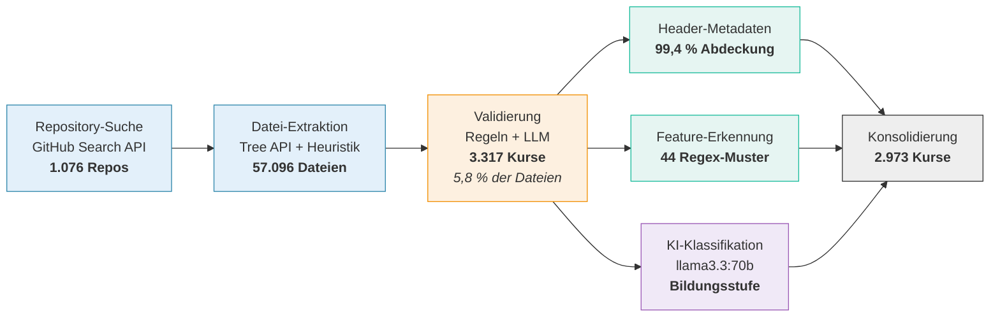

<!--
version:  1.0.0
language: de

narrator: Deutsch Female

tags: Vortrag, DELFI, LiaScript, OER, Feature-Adoption, Korpusanalyse

comment:  Designed but Not Used? — Feature-Adoption in einem System ohne
          Telemetrie. Vortrag auf der DELFI 2026.
          Vortragende: Sebastian Zug, André Dietrich, Ines Aubel
          (TU Bergakademie Freiberg).

author:   Sebastian Zug, André Dietrich, Ines Aubel, Martin Lommatzsch, Volker Göhler

import: https://raw.githubusercontent.com/LiaTemplates/LiveEdit-Embeddings/refs/tags/0.0.1/README.md
import: https://raw.githubusercontent.com/LiaTemplates/mermaid_template/0.1.4/README.md

persistent: true

edit: true

@style
.cols {
  display: flex;
  flex-wrap: wrap;
  align-items: center;
  justify-content: space-between;
  gap: 2rem;
}

.cols > * {
  flex: 1;
  min-width: 280px;
}

.bigfact {
  text-align: center;
  padding: 1.2rem 0;
}

.bigfact .num {
  font-size: 3.4rem;
  font-weight: 700;
  line-height: 1.1;
  color: #2E86AB;
}

.bigfact .cap {
  font-size: 1.15rem;
  color: #555;
  margin-top: .4rem;
}
@end

-->

[](https://liascript.github.io/course/?https://raw.githubusercontent.com/LiaPlayground/DELFI_2026_presentation/main/README.md)

# Designed but Not Used?

<h2>A Feature Adoption Analysis of LiaScript Courses</h2>

<div class="cols">
<div>

> __DELFI 2026 — Die 24. Fachtagung Bildungstechnologien__
>
> __Potsdam, September 2026__


</div>
<div>

> **Sebastian Zug$^1$, André Dietrich$^1$, Ines Aubel$^1$, Martin Lommatzsch$^2$, Volker Göhler$^1$**
>
> **$^1$TU Bergakademie Freiberg, $^2$Geschwister-Scholl-Gymnasium Freiberg**


</div>
</div>

<div class="cols">
<div>

Das zugehörige Paper finden Sie in der Digitalen Bibliothek der GI unter [Link](https://dl.gi.de/items/4da2a537-6a46-4f90-9276-618d41e8409b)

<!-- style="height:250px" -->

</div>
<div>

Dieser Vortrag ist unter folgenden [Link](https://liascript.github.io/course/?https://raw.githubusercontent.com/LiaPlayground/DELFI_2026_presentation/main/README.md) zu finden.

[qr-code](https://liascript.github.io/course/?https://raw.githubusercontent.com/LiaPlayground/DELFI_2026_presentation/main/README.md)

</div>
</div>

---

Dieser Foliensatz steht unter einer Creative-Commons-Lizenz (CC BY 4.0). Der Quelltext liegt auf [GitHub](https://github.com/LiaPlayground/DELFI_2026_presentation).

--{{0}}--
Herzlich willkommen. Diese Annotationen fassen die Erläuterungen im Zusammenhang mit der Vorstellung des Papers anlässlich der DELFI 2026 zusammen. Ausgehend vom 

# Was ist LiaScript?

> [!TIP]
> **LiaScript ist Markdown — erweitert um genau die Elemente, die für
> interaktive Lehre fehlen. Dabei bleibt alles ein Text - den man beliebig verändern und kompieren kann.**

--{{0}}--
Zunächst kurz: Was ist LiaScript überhaupt? Für alle, die es noch nicht kennen.

````markdown @embed.style(height: 520px; min-width: 100%; border: 1px black solid)
<!--
import: https://raw.githubusercontent.com/liaTemplates/ABCjs/main/README.md
-->
# TU Bergakademie Freiberg

**Standard Markdown**

Die Bergakademie wurde **1765** gegründet und ist damit die älteste noch bestehende ~~Montanuniversität~~.

**Quizz**

Welches Element wurde in Freiberg entdeckt?

[[ (Germanium|Indium) ]]

**Interaktion**

``` abc
X:353
T: GLUECK AUF DER STEIGER KOEMMT
N: E1512
O: Europa, Mitteleuropa, Deutschland
R: Staende -, Bergmanns - Lied
M: 4/4
L: 1/16
K: G
| G8F4A4 | G8z8 | B8A4c4 | B8z4G2A2 | B4B4B4A2B2 | c4A3AA4
A2B2 | c4c4c4B2c2 | d4B3BB4A4 | G8F8 | G4e4d4c2A2 | B8A8 | G8z8
```
@ABCJS.eval

??[Familienschacht Freiberg](https://sketchfab.com/3d-models/familienschacht-freiberg-germany-7c7d30506c554385a4a4321366e2e601 "Quelle: sketchfab.com")
````

--{{0}}--
Links der Quelltext, rechts das Ergebnis. Formatierung, Mathematik, Tabellen
und Quizze — alles in einer Textdatei, alles sofort im Browser. Genau diese
Bausteine sind es, deren Nutzung wir später vermessen.

## Sovereignty by Design

> [!IMPORTANT]
> LiaScript Dokumente werden im Browser interpretiert - die Ausführungsumgebung läuft lokal. 

<div class="cols">
<div>

- **kein Server** → keine Logs
- **keine Accounts** → keine Nutzerprofile
- **keine Telemetrie** → keine Nutzungsdaten

</div>
<div>

> __Autor:innen behalten die volle Kontrolle über ihre Inhalte bzw. teilen diese sehr einfach.__
>
> Wir wissen dafür **nicht**, wie LiaScript verwendet wird.

</div>
</div>

--{{0}}--
Das ist eine bewusste Designentscheidung: keine Server, keine Konten, keine
Telemetrie. Für offene Bildungsressourcen ist das genau richtig. Aber es hat
einen Preis — und der ist der Ausgangspunkt dieses Papers.

## Die Community wächst ...


<div class="bigfact">
<div class="num">5.042</div>
<div class="cap">Kurse in 293 Repository-Accounts · Stand August 2026</div>
</div>

> __... und damit die Nachfrage nach Tutorials und Workshops.__

# Das Problem

> [!IMPORTANT]
> **Wer ist eigentlich die Zielgruppe und welche Feature sollten dort fokussiert werden?**

<details>
<summary>Sachkundeunterricht Klasse 4 - Adrian Nemetschek - ([Link zum Material](https://github.com/aua-einiges/LiaScript_Sachunterricht_Lernbereich3/blob/main/DL_Sachunterricht1_Nem%20(1).md)</summary>

<iframe
  src="https://liascript.github.io/course/?https://raw.githubusercontent.com/aua-einiges/LiaScript_Sachunterricht_Lernbereich3/main/DL_Sachunterricht1_Nem%20(1).md#3"
  style="width:100%; height:80vh; border:1px solid #ccc"
  allowfullscreen>
</iframe>

</details>

<details>
<summary>Fonts Template für wissenschaftliche Community - André Dietrich - ([Link zum Material](https://liascript.github.io/course/?https://raw.githubusercontent.com/LiaPlayground/Fonts/main/README.md#6))</summary>

<iframe
  src="https://liascript.github.io/course/?https://raw.githubusercontent.com/LiaPlayground/Fonts/main/README.md#2"
  style="width:100%; height:80vh; border:1px solid #ccc"
  allowfullscreen>
</iframe>

</details>

> [!TIP]
> __Die Vermutung, dass unterschiedliche Anwendungskontexte eine verschiedene Nutzungsmuster zeigen ist offensichtlich, aber wie können wir das nachweisen?__

# Methodik der Analyse

> [!IMPORTANT]
> **Kurse liegen in öffentlichen Repositories. Das ist der einzige Kanal, über den wir Nutzung beobachten können.**

<details>

<summary>LiaScript Gehversuche - Irina Feldbrügge - ([Link zum Material](https://liascript.github.io/course/?https://raw.githubusercontent.com/LiaPlayground/Fonts/main/README.md#6))</summary>

<iframe
  src="https://liascript.github.io/course/?https://raw.githubusercontent.com/IRFE2023/LIASCRIPT/refs/heads/main/warum.md#1"
  style="width:100%; height:80vh; border:1px solid #ccc"
  allowfullscreen>
</iframe>

</details>

> [!TIP]
> Die manuelle Erfassung der Rückmeldungen der Nutzenden ist offenbar kein geeignetes Vorgehensmodell.

## Der Korpus

<div class="cols">
<div>

<!-- data-type="none" -->
| | |
|---|---|
| Validierte Kurse | **3.317** |
| Committer | **314** |
| Repository-Accounts | **205** |
| Stand | **März 2026** |

*Die Analyse nutzt den Stand von März 2026 — der Korpus ist seither
weiter gewachsen.*

</div>
<div>

> [!WARNING]
> **Wichtige Einschränkung**
>
> Wir messen *author adoption* — welche Features Autor:innen **einbauen**.
> Nicht, was Lernende damit tun.

</div>
</div>

     {{1}}
Vier didaktisch motivierte Kategorien, **44 Features**:
**Presentation** · **Interaction** · **Reuse** · **Embedding**

--{{0}}--
Wir haben gut dreitausend validierte Kurse von GitHub eingesammelt und jeden
daraufhin untersucht, welche der vierundvierzig LiaScript-Features darin
vorkommen. Eine wichtige Einschränkung gleich vorweg: Wir sehen, was
Autor:innen einbauen — nicht, was Lernende davon tatsächlich nutzen.

## Die Verarbeitungskette



     {{1}}
> [!NOTE]
> Von **57.096 Dateien** bleiben **3.317 Kurse** — und für den
> Gruppenvergleich **2.973** mit eindeutiger Bildungsstufe.

--{{0}}--
Wie kommen wir zu diesen Zahlen? Wir starten mit einer Repository-Suche über
die GitHub-API und ziehen daraus alle Markdown-Dateien — siebenundfünfzigtausend
Kandidaten. Die Validierung ist der entscheidende Schritt: regelbasiert, wo die
Indikatoren eindeutig sind, mit einem Sprachmodell dort, wo es unklar ist.
Übrig bleiben dreitausenddreihundert echte Kurse, also knapp sechs Prozent.

--{{1}}--
Danach laufen drei Zweige parallel: Header-Metadaten, die Feature-Erkennung mit
vierundvierzig Mustern, und eine KI-gestützte Einordnung der Bildungsstufe.
Letztere ist die Grundlage für den Gruppenvergleich, den Sie gleich sehen —
dafür bleiben knapp dreitausend Kurse mit eindeutiger Zuordnung.

# Teil 4 — Ergebnisse

--{{0}}--
Kommen wir zu den Ergebnissen — und die erste Zahl hat uns selbst überrascht.

## Die gute Nachricht

<div class="bigfact">
<div class="num">89 %</div>
<div class="cap">des Feature-Raums werden messbar genutzt</div>
</div>

Nur **5 von 44** Features liegen unter 1 %.

     {{1}}
> [!NOTE]
> Das Problem ist also **nicht**, dass Features ungenutzt bleiben.

--{{0}}--
Neunundachtzig Prozent der Features werden in messbarem Umfang eingesetzt.
Nur fünf von vierundvierzig liegen unter einem Prozent. Unsere Sorge, große
Teile der Sprache seien tote Buchstaben, war unbegründet.

--{{1}}--
Die eigentliche Erkenntnis liegt woanders.

## Jede Gruppe nutzt ihr eigenes Subset


--{{0}}--
Denn sobald man den Korpus nach Autorengruppen aufteilt, zerfällt das Bild.
Jede Gruppe bewegt sich in ihrem eigenen Ausschnitt der Sprache.

## Hochschule und Schule — gegenläufig

| Feature | Comm-Uni | Comm-School |
|---|---:|---:|
| Narrator | **88,5 %** | 60,8 % |
| Code-Blöcke | **53,7 %** | 28,5 % |
| WebApps | 4,8 % | **24,2 %** |
| Logo / Branding | 21,4 % | **57,0 %** |

     {{1}}
> Gleiche Sprache. Zwei Communities. **Entgegengesetzte Schwerpunkte.**

--{{0}}--
Am deutlichsten wird das beim Vergleich von Hochschule und Schule. Die einen
setzen auf Sprachausgabe und Code, die anderen auf Medien und visuelle
Gestaltung. Dieselbe Sprache, zwei fast gegenläufige Profile.

## Zwischenfrage

Welches Feature nutzen **Schul**-Autor:innen deutlich häufiger
als Autor:innen an Hochschulen?

[( )] Narrator
[( )] Code-Blöcke
[(X)] WebApps und visuelles Branding
[( )] ASCII-Diagramme
****************************************

Schulische Kurse setzen auf **Medien und Gestaltung**,
Hochschulkurse auf **narrativen Text und Code**.

****************************************

--{{0}}--
Kurze Zwischenfrage — was meinen Sie?

## Ein Beispiel aus dem September

<div class="cols">
<div>

Ein Grundschulkurs, Sachunterricht Klasse 4:

- **24 Aufgaben**, 21 Quizze, 28 Bilder
- kein Narrator, keine Makros, keine Imports
- **35 MB Bilder** im Repository

</div>
<div>

```markdown
<!--
author: Adrian Nemetschek
language: de
-->
```

__Das ist der komplette Header.__

</div>
</div>

     {{1}}
> [!NOTE]
> Die Hürde liegt **früher**, als wir dachten: nicht bei komplexen Features,
> sondern beim Bildhandling.

--{{0}}--
Wie das konkret aussieht, zeigt ein Kurs, der erst vor wenigen Tagen
entstanden ist. Zwei Zeilen Konfiguration, vierundzwanzig Aufgaben, viele
Bilder — und sonst nichts. Genau das Schulprofil aus der Tabelle.

--{{1}}--
Bemerkenswert sind die fünfunddreißig Megabyte Bilder, davon der größte Teil
gar nicht verwendet. Niemand hat dem Autor gesagt, dass man Bilder für das Web
verkleinert. Das ist kein Vorwurf — das ist eine Lücke in unserem Onboarding.

## Infrastruktur schlägt Didaktik

Erinnern Sie sich an die blaue Fläche?

<div class="cols">
<div>

> __MINT-the-GAP__
>
> Ein Schulprojekt mit einheitlichem Template.

</div>
<div>

Makros **99,7 %** · Imports **98,3 %**

Narrator **9,4 %** · Animationen **0,6 %**

</div>
</div>

     {{1}}
> [!IMPORTANT]
> Eine geteilte Konfiguration hebt alles **in ihrem Rahmen** —
> und lässt alles außerhalb unberührt.

--{{0}}--
Und hier kommt die blaue Fläche von vorhin zurück. Ein einzelnes Schulprojekt
mit einem gemeinsamen Template. Die Features, die im Template stecken, liegen
bei nahezu hundert Prozent. Alles andere bei fast null.

--{{1}}--
Die Autoren dort haben keine didaktische Entscheidung gegen Sprachausgabe
getroffen. Sie ist in ihrer Vorlage schlicht nicht vorgesehen. Infrastruktur
prägt Adoption mindestens so stark wie Didaktik.

## Konsequenz für unsere Tutorials

Die Gruppen steigen auf **unterschiedlichen Leitern** ein:

     {{1}}
**Hochschule:** Narrator → Code & Makros → *stockt bei Animationen*

     {{2}}
**Schule:** visuelle Medien → Quizze → *erreicht Code kaum*

     {{3}}
> [!IMPORTANT]
> **Ein linearer Tutorial-Pfad ist deshalb falsch.**
>
> Onboarding muss dort ansetzen, wo die jeweilige Gruppe steht.

--{{0}}--
Was heißt das nun für unsere eigene Arbeit?

--{{1}}--
Hochschulautoren beginnen bei Sprachausgabe und Text, gehen weiter zu Code und
Makros — und bleiben bei Animationen stehen.

--{{2}}--
Schulische Autoren starten bei Bildern und Medien, kommen über Quizze — und
erreichen Code praktisch nie.

--{{3}}--
Das ist die zentrale Konsequenz: Ein einziger, linearer Einführungskurs geht an
beiden Gruppen vorbei. Wir brauchen kontextspezifische Einstiege — und genau
das ändern wir gerade an unseren Workshops.

## Zusammengefasst

- **89 %** des Feature-Raums werden genutzt — das ist nicht das Problem
- Jede Community erkundet nur **ihr eigenes Subset**
- **Autoren-Infrastruktur** prägt Adoption so stark wie Didaktik
- Onboarding braucht **kontextspezifische Einstiege**

     {{1}}
> Ein Korpus ist bei fehlender Telemetrie ein **tragfähiger Proxy** —
> wiederholbar, ohne die Datensparsamkeit aufzugeben.

--{{0}}--
Zusammengefasst: Das Problem ist nicht, dass Features ungenutzt bleiben,
sondern dass jede Gruppe nur ihren Ausschnitt kennt. Und die Infrastruktur,
mit der Autoren arbeiten, prägt das mindestens so stark wie ihre Didaktik.

--{{1}}--
Und methodisch: Man kann die Nutzung eines datensparsamen Systems untersuchen,
ohne die Datensparsamkeit aufzugeben. Der Korpus ist ein Proxy — aber ein
tragfähiger.

## Vielen Dank

<div class="cols">
<div>

__Diesen Vortrag öffnen:__

[qr-code](https://liascript.github.io/course/?https://raw.githubusercontent.com/LiaPlayground/DELFI_2026_presentation/main/README.md "Diesen Vortrag im Browser öffnen")

</div>
<div>

**Fragen?**

sebastian.zug@informatik.tu-freiberg.de

__Quelltext:__
<https://github.com/LiaPlayground/DELFI_2026_presentation>

__Datensatz:__
`LiaPlayground/liascript-adoption-dataset`

</div>
</div>

--{{0}}--
Vielen Dank für Ihre Aufmerksamkeit. Den Foliensatz können Sie über den
QR-Code direkt öffnen — er ist selbst ein LiaScript-Kurs, Sie können ihn also
sofort editieren und weiterverwenden. Der Datensatz liegt ebenfalls offen.
Ich freue mich auf Ihre Fragen.
